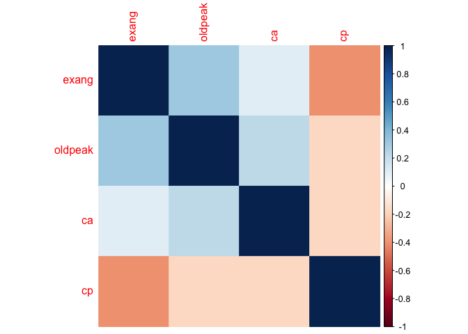
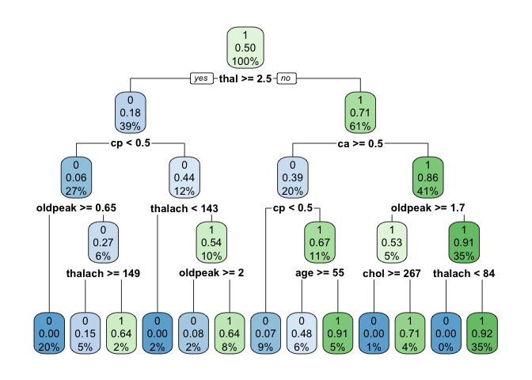
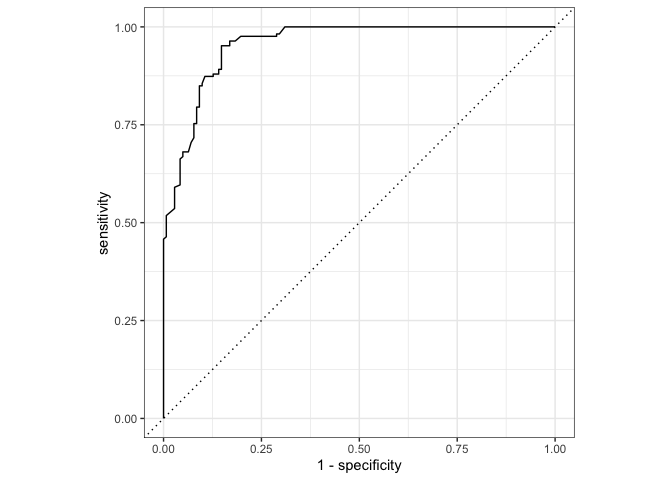

# Introduction

In this project, we seek to use statistical machine learning techniques to analyse patient data in order to diagnose heart disease more effectively, as well as to propose suggestive treatment.


## Why Is the Heart Important and How Is Heart Disease Defined

The human heart persistently supplies blood throughout the body through the circulatory system so our organs can operate. However, the heart is still susceptible to injuries, which can be intensely damaging or even life-threatening. Excess fluid in body tissues, impaired thinking, and sudden weight changes are some indicators of a failing heart (American Heart Association, n.d). Understanding what causes and further exacerbates heart problems is crucial for patient health.

There are several types of heart disease including strokes and transient ischaemic attacks, peripheral arterial disease, and cortic diseases; however, this study focuses on **Coronary Artery Disease (CAD)**, which is caused when the heart is strained by reduced or blocked oxygen-rich blood flow (NHS, 2017). A buildup of plaque (atherosclerosis) caused primarily by cholesterol and fats shrink the arteries over several years, eventually culminating in CAD through chest pain (anginas), heart attacks, and heart failure (Mayo Clinic, n.d.).

## Where Is Our Dataset From and What Can We Understand From It?

A 1988 heart disease study from the University of California Irvine created a discriminant function model for predicting angiographic coronary disease in patients and compared the results to a Bayesian algorithm (Detrano et al., 1989). It is common for doctors and researchers to conduct an X-ray scan of a patient’s heart to detect the presence or absence of angiographic coronary disease by checking if the blood vessels are sufficiently open and unblocked (Mayo Clinic, n.d.). The result of an angiography is either heart disease is present or absent. This study collected patient results from angiographies and relevant health diagnostics to create their predictor model (Detrano et al., 1989).

The original study by Detrano et al. (1989) aggregated patient data from the Cleveland Clinic (303 patients); Budapest, Hungary (425 patients); Zurich and Basel, Switzerland (143 patients); and the Veterans Administration Long Beach, California (200 patients). Due to restrictions of practicality and accessibility, we were only able to make use to the Cleveland Clinic subset which had 1,025 observations.

### The Variables in Our Data

**Our dataset has 7 categorical predictors:** 

- **sex** – biological sex of the patient; 1 = male, 0 = female.  
- **cp** – chest pain type; integer values 0 - 3 inclusive.  
- **fbs** – fasting blood sugar; 1 if > 120 mg/dl, 0 if 1 if < 120 mg/dl.
- **restecg** – resting electrocardiographic results (if extra load on the heart and presence of defects); integer values 0 - 2 inclusive.
- **exang** – exercise-induced angina (heart pain while exercising); 1 = yes, 0 = no. 
- **slope** – slope of the peak exercise ST segment  
- **thal** – exercise thallium scintigraphic defects  

**And 6 quantitative predictors:**

- **age** – age of the patient; integer number of years  
- **thalach** – maximum heart rate achieved; Beats per Minute (BPM)  
- **ca** – number of major vessels (0–3) colored by fluoroscopy  
- **oldpeak** – short-term depression induced by exercise relative to rest (indicating heart strain due to cholesterol); values 0 through 6.2.
- **trestbps** – resting blood pressure; in mm Hg on admission to the hospital  
- **chol** Serum cholesterol; in mg/dl


## What are Our Dataset's limitations?

### Generalisation

In an ideal scenario, the findings of our project would be able to help patients around the globe. Even with the most well crafted machine learning approach, we can only be confident that we most appropriately capture the true underlying relationships within our data. However it cannot be said that these relationships or that this Data Generating Process (DGP) will hold beyond our data. 

An ideal dataset would allow us to generalise to as large a population as possible - to all kinds of patients around the globe. However, as we discuss in the following sections, our dataset is limited in this regard.

#### Generalisation Across Time

Although these data were collected from a large study and helped researchers understand more in understanding coronary artery disease, there are some important limitations in the data to consider. These data were published in 1988 and, at the time of this report, important medical, political, social, and environmental advancements have been made in the past 37 years.

#### Generalisation Across Gender

Additionally, our dataset has a lot more men (713) then women (312) which could suggest that models fitted on these data will skew to accommodate male measurements better. This can be dangerous since women, as well as other vulnerable communities, are often overlooked in the medical community compared to white men (Beery, 1995; Cleveland Clinic, n.d.).

#### Generalisation Across Geographies

Finally, these data were collected in one hospital in one state in one country, so the data likely represents that particular area well but maybe not the global population. A patient from humid continental Ohio is likely very different from a patient in the Mediterranean climate of Algeria. If we strive to use our models to help patients around the globe, we would benefit from a more diverse dataset that ranges across cultures, climates, nations, and peoples, and hence can generalise across these dimensions.

### Questionable Data Pre-Cleaning at the Source

Besides these data collection concerns we also encountered issues with our dataset sourced from Kaggle, namely related to counter-intuitive findings that raised concerns about the accuracy of certain attributes. 

#### Reversed Outcome Variable

For instance, the dataset suggests that experiencing chest pain during exercise correlates with a lower likelihood of heart disease, while showing no chest pain increases the risk of having heart disease, an interpretation that contradicts science (Hamada, 2025). 

This anomaly suggests that **the `target` variable** in our Kaggle dataset **may have been reversed** at the source by those who uploaded it. This would mean that:

- A value of 0 actually represents a diseased heart (CAD negative)
- A value of 1 indicates a healthy heart (CAD positive)

This contrasts with the convention (and as stated in the documentation/source page) where 0 = healthy and 1 = diseased. 

#### Duplicate Values

The dataset also seems to contain multiple duplicate rows of information, potentially raising questions regarding the reliability of the source (Kalsi, 2024). This can be problematic as there are 723 rows of duplicated entries, which could introduce bias and subsequently negatively impact model performance (Rehman, 2023). 

#### Incorrect Entries

Moreover, there are incorrect entries, perhaps reflective of "fat finger" errors when transcribing data from the original data source (Mahan, 2022). For example, the predictor, `thal` that should only have entries 0-2, as can be seen in the screenshot of attribute information as provided by Kaggle, but there are 410 entries containing 3. Here, what 3 stands for can be questioned.


### Adjustments For these Limitations

To account for the limitations regarding **generalisation**, we form and attempt to justify certain arguments about the true data generating process and about human biology that would support the wider application of this research. We delve into more detail in our analysis sections.

To account for the limitations regarding **data pre-cleaning at the source**, we simply emphasise that while the coefficients, partial dependencies discussed in our report remain valid in terms of magnitude and so their *relative importance* should be interpreted at face value, their *directional* interpretation should be considered in reverse.


## How is heart disease diagnosed in practice?

Doctors diagnose heart disease by a mix of patient-reported symptoms, common physical examinations, and different diagnostic tests based on their findings. 


### Electrocardiograms (EKGs)

Electrocardiograms (EKGs) are a non-invasive procedure that measure the heart muscle's electrical activity and is common for identifying irregular heartbeats (arrhythmias) and poor blood flow (ischemia) (British Heart Association, 2016). 

Physicians usually have patients do two EKG tests while they are resting and while exercising (called a stress test) to see how the heart performs under exertion to properly identify if they have heart disease and its severity. 

### Echocardiograms

Another common non-invasive diagnostic tool is an echocardiogram which uses high-frequency sound waves, an ultrasound, to scan the heart and nearby blood vessels in real time (NHS, 2017). These "echos" help cardiologists get an overview of the structural health of a patient's heart which is vital when recovering from cardiovascular damage. 

### Coronary Angiography

The standard of care, however, is a coronary angiography where contrast dyes are injected through coronary arteries and X-rays identify blockages; unlike the aforementioned procedures, an angiography is invasive however provides more actionable value to the physicians (NHS, 2017). 

These procedures are quick enough that patients can return home on the same day with little impact to their normal routine. 

### The Measures in our Data

Features present in the UCI Heart Disease dataset such as `slope`, `cp`, and `thalach` are measurements as a result of these medical diagnostic tests, whereas other features like `sex`, `age`, and `cholesterol` are recorded from physical examinations. 

Doctors then take these measurements are use their extensive domain knowledge to conclude if a patient has coronary artery disease or not. Their conclusions are supported by test results and by comparing medical measurements, such as cholesterol, with what is medically accepted to be a "safe" or "healthy" amount in someone of a similar sex, age, and other morphometric characteristics.


## Why is heart disease "bad" and why is it such a prevalent issue?

Coronary artery disease (CAD) is the leading cause of death across both genders in the United States (the source of our dataset) and the second leading cause of death (behind Alzheimer's/dementia) across both genders in the United Kingdom (British Heart Foundation, 2025; CDC 2025). 

For context, 1 in 8 men and 1 in 14 women die from CAD for an average of one person dying every 8 minutes (British Heart Foundation, 2025). Since artery disease builds up over years it is a silent disease and the first symptoms are usually severe like chest pain or even a heart attack. 

Eventually, CAD reduces a patient's quality of life because the strain on the heart limits their physical activity, causes fatigue, strong chest pain, and even long-term disability or hospitalization (Penn Medicine, n.d.).

Although this disease is dangerous current medicine is advance enough to make it preventable through medications, interventions, and lifestyle changes. 

Therefore, it is essential for physicians to find ways to accurately diagnose the right patients with heart disease before it becomes too severe, instead of simply relying on the patient to seek treatment, which only tends to happen once the first symptoms and at which point are already severe, start to show.

Unfortunately, like mentioned before, the vulnerable members of society (people of color, women, LGBTQ+) are often overlooked and therefore under-diagnosed and undertreated, adding to these large fatality figures.

A key way to support this is to support diagnoses that can be made with **as few measurements as possible**, and measurements that are as **easy to collect as possible**. Such diagnoses can be carried out in as little time with as few resources (staff, equipment, and hence funding) and with as little invasive-ness as possible. This may encourage *earlier* diagnoses that help patients receive treatment/treat themselves long *before* symtoms materialise.

**More accurate** diagnoses also give medical professionals more confidence to carry out more serious treatments despite their possible consequences, since the probability of administering a potentially harmful treatment when it may not even be so necessary is lower. This makes it more likely that those suffering the most severe forms of heart disease can receive the treatments necessary to improve their condition.

Moroever, encouraging treatments that are as simple and practical as possible, while minimising possible patient harm, may reduce strain on limited treatment resources and enable more patients to improve their health and prevent heart disease instead of relying on typically more expensive, reactive treatment (ibid).

## Our Objectives

Therefore, we lay out the following key objectives:

1.  To accurately predict the likelihood of an individual developing heart disease with as few and as practical measures as possible. Specifically, we wish to identify those at higher risk and develop a model that could be used to assist in diagnosis as far beyond our initial sample as reasonably possible.

2.  To identify practical, non-surgical treatment methodologies that can help reduce heart disease risk.


# Setup


## Packages Installation

We begin by requiring all necessary packages for this document to run. Any additional code reduces error output and helps the packages collaborate better.


## Environment Set-Up and Dataset Retrieval

We also define the current environment so that this document is self-sufficient in retrieving the necessary files, like the dataset, independently regardless of which machine it runs on.


``` r
# Get and change the current working directory in order to retrieve the
# `data_path` and `predictions_path`
setPath <- dirname(getSourceEditorContext()$path)
data_path <- paste0(getwd(), "/../data/")
predictions_path <- paste0(getwd(), "/../predictions/")

Heart <- read.csv(paste0(data_path, "Heart.csv"))
```

## Data Cleaning

### Global Data Pre-processing to Ensure All Models Are Fitted on Reliable Data

To ensure that the data will be read by R correctly, we do some manual pre-processing which involves renaming the response column, re-ording columns, and re-coding factor variables. A preview of the first 6 lines of the data are shown below.


``` r
# Copy the `target` column to `y` (need unfactored `target` for gradient descent)
Heart$y <- Heart$target

# Move the last column to the front so that the cross-validation works
Heart <- Heart[, c(ncol(Heart), 1:(ncol(Heart) - 1))]

# Change `y` to be factor so that  it is recognised as classification
Heart_non_fctr <- Heart
Heart$y <- factor(Heart$y)

# Recode `sex` for better interpretability
Heart <- Heart %>% mutate(sex_factor = recode(sex, "0" = "Female", "1" = "Male"))

# Get number of predictors/features
n_preds <- sum(names(Heart) != "y")

# Inspecting the top of the dataframe
head(Heart)
```

```
##   y age sex cp trestbps chol fbs restecg thalach exang oldpeak slope ca thal
## 1 0  52   1  0      125  212   0       1     168     0     1.0     2  2    3
## 2 0  53   1  0      140  203   1       0     155     1     3.1     0  0    3
## 3 0  70   1  0      145  174   0       1     125     1     2.6     0  0    3
## 4 0  61   1  0      148  203   0       1     161     0     0.0     2  1    3
## 5 0  62   0  0      138  294   1       1     106     0     1.9     1  3    2
## 6 1  58   0  0      100  248   0       0     122     0     1.0     1  0    2
##   target sex_factor
## 1      0       Male
## 2      0       Male
## 3      0       Male
## 4      0       Male
## 5      0     Female
## 6      1     Female
```

### Partitioning the Data Into Training and Testing Subsets for Future Fitting and Predicting

Finally, we split the dataset into `training` and `testing` subsets by using `tidymodel`'s `initial_split` method, which partitions the data such that 70% of the observations are allocated to the training set and the remaining 30% are allocated to the testing set.


``` r
Heart_split <- initial_split(Heart, prop = 0.7)

Heart_train <- Heart_split %>% training()
Heart_test <- Heart_split %>% testing()
Heart_valid <- Heart_split %>% testing()
```

## Exploratory Data Analysis

We start by taking a look at the joint distribution of predictors against each other and the outcome, `y`. This is done to potentially motivate certain procedures that are more tailored to strike a balance between bias and variance given the distributional properties of the data.


``` r
# Sequentially create scatter, line and box plots as well as correlations between different pairs of variables
# this makes separate plots for each set of 3 predictors and the outcome (hence 4 sets of variables in each plot)
for (i in seq(2,n_preds,3)) {
  plot <- ggpairs(
    Heart[, c(i:(min(n_preds,i + 2)), 1)], 
    progress = FALSE
  ) + 
    theme_minimal()
  
  print(plot)
}
```

```
## `stat_bin()` using `bins = 30`. Pick better value with `binwidth`.
## `stat_bin()` using `bins = 30`. Pick better value with `binwidth`.
## `stat_bin()` using `bins = 30`. Pick better value with `binwidth`.
```

<!-- -->

```
## `stat_bin()` using `bins = 30`. Pick better value with `binwidth`.
## `stat_bin()` using `bins = 30`. Pick better value with `binwidth`.
## `stat_bin()` using `bins = 30`. Pick better value with `binwidth`.
```

<!-- -->

```
## `stat_bin()` using `bins = 30`. Pick better value with `binwidth`.
## `stat_bin()` using `bins = 30`. Pick better value with `binwidth`.
## `stat_bin()` using `bins = 30`. Pick better value with `binwidth`.
```

<!-- -->

```
## `stat_bin()` using `bins = 30`. Pick better value with `binwidth`.
## `stat_bin()` using `bins = 30`. Pick better value with `binwidth`.
## `stat_bin()` using `bins = 30`. Pick better value with `binwidth`.
```

<!-- -->

```
## `stat_bin()` using `bins = 30`. Pick better value with `binwidth`.
## `stat_bin()` using `bins = 30`. Pick better value with `binwidth`.
```

<!-- -->

Note in the above that the distribution of most of the integer variables appear to have a discrete Gaussian/bell-curve type distribution within each class (with the exception of `trestbps` (resting blood pressure)).

Moreover, the distributions for both integer and factor variables can be distinct conditional on each class. Where the distributions are conditionally Gaussian implies that both the mean and covariance for each class is different for each class, possibly motivating a Quadratic Discriminant Analysis (QDA) (as opposed to Linear Discriminant Analysis (LDA), which assumes a covariance matrix that is constant for each class).

However, this is not precisely a normal (conditional on `y`) for a number of variables, especially given the large number of categorical predictors, limiting the possible usefulness of QDA as a model fitting procedure.

Naive Bayes also appears a dud, as we often observe high correlations between the features/predictors across both classes, and naturally this is likely to extend to high correlations within class as well. Therefore, we cannot make the necessary argument that the predictors are independent within a given class.

As a result, we may be limited to other model-fitting procedures that must be carefully parameter-tuned in order to avoid over-fitting.


### Examining the Class Balance


Knowing the class balances in our data will help explain our results and glean insight into the strengths and limitations of these data. As shown below, the class ratios appear balanced.


``` r
# We need the training set to be balanced, yet the validation set to have 68% balance.
outcome_counts_fold <- Heart %>% count(y)
outcome_counts_fold$proportion <- outcome_counts_fold$n / sum(outcome_counts_fold$n)
const_yhat_success <- outcome_counts_fold$proportion[[2]]
outcome_counts_fold
```

```
##   y   n proportion
## 1 0 499  0.4868293
## 2 1 526  0.5131707
```


``` r
const_yhat_success
```

```
## [1] 0.5131707
```
The fact that classes are generally balanced means that, all else equal, it might not make as much sense to tailor the conditional probability threshold beyond which we assign a patient to be predicted a certain class. Nonetheless, we do experiment with this later.


## Model fitting and defining helper functions


### Creating a model types and "best" specifications data frame

For each model fitting procedure, we create a grid of tuning parameters and model inputs (including a choice of predictors and functional forms where applicable).

We then iteratively fit all of these specifications and calculate the validation/cross-validation set accuracy, choosing the "best" model usually as that with the highest accuracy, or the simplest specification with a high enough accuracy.

In our classification setting, this is the misclassification rate.

We then store this specification (all the inputs we need to run this fit) and its accuracy in this aggregated table, repeating this for all model fitting procedures.

In other words, each row corresponds to a model fitting procedure (e.g. logistic regression, classification tree), with each column giving some parameter or information about the specification that achieved the best accuracy given that model procedure.

This allows us to create the table above to store any number of tuning parameters and use any form of accuracy measure. Since we are working with a classification problem, we use the misclassification rate (or misclass rate) and allow for up to 3 tuning parameters.

In this table, sub-models and functional forms and combinations of predictors are also counted as tuning parameters, just for maintainability, even though this is not strictly true.


``` r
gen_models_df <- function(len=10, accuracy_measures = c("min_mse")) {
  df = data.frame(
    model_type = character(len),
    model_name = character(len)
  )
  for (measure in accuracy_measures) {
    df[[measure]] <- numeric(len)
  }
  #tp stands for tuning parameter
  df$tp1_name = character(len)
  df$tp2_name = character(len)
  df$tp3_name = character(len)
  df$tp1_value = numeric(len)
  df$tp2_value = numeric(len)
  df$tp3_value = numeric(len)

  return(df)
}

Heart_models <- gen_models_df(accuracy_measures = c("misclass_rate"))
```

### Functions for Model Tuning

We define a set of functions to select the "best" tuning parameters for different models, often defined as the simplest model past a threshold level of prediction accuracy.

#### Define a Function That Finds Prediction Accuracy

This takes predictions as inputs and calculates the validation misclassification rate, or, optionally, Mean Squared Error (MSE) accordingly.


``` r
calculate_error <- function(predictions, true_values, classify) {
  if (classify) {
    return(mean(predictions != (as.numeric(true_values) - 1))) # for classification, counts the proportion of times the predicted class is different from the true class, hence 'mis-classified'
  } else {
    return(mean((predictions - true_values)^2)) # for continuous, takes the mean squared error (MSE)
  }
}
```

#### Functions to Calculate Validation Set Accuracy for a Grid of Tuning Parameters

We use `tidymodels` syntax for efficiency and modularity with different fitting procedures.

This function *itself* uses a separate, helper function to get the model specification (including the fitting procedure and the engine) into `tidyverse`'s desired format first.

##### Define a Function that Retreives the Model Specification


``` r
# Function to get model specification
get_model_spec <- function(model_fitting_procedure, engine, tuning_params) {
  if (model_fitting_procedure == "tree") {
    model_spec_updated <- decision_tree(
      mode = "classification", 
      cost_complexity = tuning_params$cp,
      tree_depth = tuning_params$maxdepth,
      min_n = tuning_params$min_n
    ) %>%
      set_engine(engine)
    
  } else if (model_fitting_procedure == "random_forest") {
    model_spec_updated <- rand_forest(
      mtry = tuning_params$mtry,
      trees = tuning_params$trees,
      mode = "classification"
    ) %>%
      set_engine(engine, probability = TRUE)
    
  } else if (model_fitting_procedure == "boosting") {
    model_spec_updated <- boost_tree(mode = "classification") %>%
      set_engine(engine)
    
  } else if (model_fitting_procedure == "logit") {
    model_spec_updated <- logistic_reg(mode = "classification") %>%
      set_engine(engine, family = "binomial")
    
  } else {
    stop("Invalid model fitting procedure. Choose from 'tree', 'random_forest', 'boosting', or 'logit'.")
  }
  
  return(model_spec_updated)
}
```

##### Define a Function That Calculates Validation Set Accuracy for a Grid of Tuning Parameters


``` r
# Function to get the accuracy for each model specification corresponding to the tuning parameters
grid_validate_tidy <- function(train_data, valid_data, tuning_grid, model_fitting_procedure, engine) {
  # Initialize empty data frames to store results and predictions
  accuracy_df <- tuning_grid
  all_preds_df <- data.frame()
  model_fits <- list()  # Initialize the list to store model fits
  
  # Iterate over each combination of hyperparameters in the tuning grid
  for(i in 1:nrow(tuning_grid)) {
    # Extract current tuning parameters
    tuning_params <- tuning_grid[i, ]
    
    # Get the model specification dynamically
    model_spec_updated <- get_model_spec(model_fitting_procedure, engine, tuning_params)
    
    # Create a workflow
    current_wf <- workflow() %>%
      add_model(model_spec_updated) %>%
      add_formula(as.formula(tuning_params$formula))
    
    # Fit the model on the training data
    model_fit <- fit(current_wf, data = train_data)
    
    # Store the model fit in the list
    model_fits[[i]] <- model_fit  # Index the model fit by i
    
    # Predict probabilities on the validation set
    prob_predictions <- predict(model_fit, valid_data, type = "prob")$.pred_1
    
    # Apply threshold to classify predictions
    predictions <- as.factor(as.numeric(prob_predictions > tuning_params$thresh))
    
    # Calculate misclassification rate
    predictions <- factor(predictions, levels = levels(valid_data$y)) # I had to force level matching because when fbs is used as a single predictor, it throws a level mismatch error, making stepwise selection a problem
    error <- mean(predictions != valid_data$y)
    
    # Store results
    accuracy_df$misclass_rate[i] = error
    
    # Put the accuracy results first and the formula last
    accuracy_df <- accuracy_df %>%
      select(misclass_rate, everything(), -formula, formula)
    
    # Store predictions
    preds_df <- data.frame(preds = predictions, prob_preds = prob_predictions) %>%
      bind_cols(valid_data %>% select(y)) %>%
      mutate(spec_no = i)
    
    all_preds_df <- rbind(all_preds_df, preds_df)
  }
  
  # Return both results and predictions, including the list of model fits
  return(list(
    accuracy_df = accuracy_df,
    preds = all_preds_df,
    model_fits = model_fits  # Add the list of model fits to the output
  ))
}
```

#### Formulas for Mixed Subset Selection

##### Define a Function That Extracts the Predictors From a Formula Column in a Tuning Grid

This is used to support mixed stepwise subset selection, where we need to iteratively be able to extract current predictors, add or remove some subset of them, and then re-fit the model.


``` r
extract_predictors <- function(formula) {
  # Remove "y ~" from the formula, since we add it back later
  formula_rhs <- gsub("y ~", "", formula)
  
  # trim spaces 
  formula_rhs <- trimws(formula_rhs)
  
  # Split into vector (each element with one of the predictors) if not empty, otherwise return an empty vector
  if (formula_rhs == "" || formula_rhs == "y ~") {
    return(character(0))  # Return empty vector if no predictors in the formula
  } else {
    return(unlist(strsplit(formula_rhs, " \\+ ")))  # Split by " + "
  }
}
```

##### Create a Function That Conducts One Forward or One Backward Stepwise Iteration


``` r
fwd_bckwd_step <- function(train_data, valid_data, tuning_params, model_fitting_procedure, engine, direction = "fwd") {
  
  # Get all predictor names except the target variable "y"
  predictors <- setdiff(names(train_data), "y")
  
  # Split current_predictors string into individual variable names, if any
  current_predictors <- extract_predictors(tuning_params$formula)  
  
  # Find remaining predictors not in the current predictor set
  predictors_left <- setdiff(predictors, current_predictors)
  
  # Track the number of predictors currently in the model
  n <- length(current_predictors) # Current number of predictors in the model
  
  # Generate formulas based on direction
  if (direction == "fwd") {
    # Forward step: Generate new formulas by adding one predictor at a time
    predictor_combos <- expand.grid(current = paste(current_predictors, collapse = " + "), new = predictors_left, stringsAsFactors = FALSE)
    if (length(current_predictors) == 0) {
      predictor_combos$formula <- paste("y ~", predictor_combos$new)
    }
    else {
      predictor_combos$formula <- paste("y ~", predictor_combos$current, "+", predictor_combos$new)
    }
    
  } else if (direction == "bkwd") {
    # Backward step: Generate new formulas by removing one predictor at a time
    predictor_combos <- expand.grid(current = paste(current_predictors, collapse = " + "), remove = current_predictors, stringsAsFactors = FALSE)
    predictor_combos$formula <- apply(predictor_combos, 1, function(row) {
      remaining_vars <- setdiff(current_predictors, row["remove"])
      paste("y ~", paste(remaining_vars, collapse = " + "))
    })
  }
  # Expand tuning_params to match the number of new formulas, each of which we will see if provides a better fit
  tuning_params <- tuning_params %>% select(-formula)
  tuning_rows <- nrow(tuning_params)
  predictor_rows <- nrow(predictor_combos)
  fwd_tuning_grid <- tuning_params %>% slice(rep(1:tuning_rows, each = predictor_rows))

  # Assign new formulas to the expanded tuning grid (it is called fwd tuning grid, but might also happen to be a backward grid)
  fwd_tuning_grid$formula <- as.character(predictor_combos$formula)

  # Calculate the accuracy for each specification in the grid
  valid_output <- grid_validate_tidy(train_data, valid_data, fwd_tuning_grid, model_fitting_procedure, engine)
  accuracy_df <- valid_output$accuracy_df
  preds <- valid_output$preds
  
  # Extract the best model (the one with the lowest validation misclassification rate)
  best_index <- which.min(accuracy_df$misclass_rate)

  best_model <- accuracy_df[best_index,]
  best_model <- best_model[1,]
  
  # Add a column that indicates that the predictions belong to the best model (so these can be pulled out later)
  preds <- preds %>% mutate(best = ifelse(spec_no == best_index, 1, 0))
  
  # Get the final new formula with the new predictors from the best model
  new_formula <- best_model$formula  
  
  # Output the best model and the new set of predictors
  return(list(accuracy_df = accuracy_df, preds=preds, best_model = best_model, new_formula = new_formula, n = n))
}
```

##### Create a Function That Conducts Mixed Stepwise Subset Selection


``` r
stepwise_selection <- function(train_data, valid_data, tuning_params, model_fitting_procedure, engine, predictors_lim = 4, fwd_steps = 3, bkwd_steps = 2) {
  # Get all predictor names except the target variable "y"
  predictors <- setdiff(names(train_data), "y")
  
  # Get the top number of predictors we can use
  n_predictors <- predictors_lim
  
  # Initialize counters for forward and backward steps
  total_fwd = 0
  total_bkwd = 0
  n = 0  # start with 0 predictors in the model
  all_preds_df <- data.frame() # initialise an empty dataframe to store the predictions from each spec
  accuracy_df <- data.frame()  # Initialise an empty dataframe for the accuracy results
  
  # Perform major iterations (each major iteration consists of fwd_steps forward and bkwd_steps backward)
  while (n < n_predictors) {
    # Forward steps (for each major iteration, take fwd_steps forward)
    for (i in 1:fwd_steps) {
      if (n + 1 <= n_predictors) {
        total_fwd = total_fwd + 1
        n = n + 1
        
        # Perform a forward selection step using fwd_bckwd_step
        fwd_step_output <- fwd_bckwd_step(train_data, valid_data, tuning_params, model_fitting_procedure, engine, direction = "fwd")
        
        # Store the best model for this forward step
        best_model <- fwd_step_output$best_model
        
        # Update selected_predictors to the new predictors from the best model
        tuning_params$formula <- as.character(fwd_step_output$new_formula)
        
        # Append a new row to accuracy_df with misclass_rate, total_fwd, etc., and tuning_params
        new_row <- cbind(
          total_steps = total_fwd + total_bkwd,
          total_fwd = total_fwd,
          total_bkwd = total_bkwd,
          n = n,
          misclass_rate = best_model$misclass_rate,
          tuning_params
        )
        accuracy_df <- rbind(accuracy_df, new_row)
        preds_df <- fwd_step_output$preds %>%
        mutate(total_steps = total_fwd + total_bkwd)
    
        all_preds_df <- rbind(all_preds_df, preds_df)
      }
    }
    
    # Backward steps (after forward steps, perform bkwd_steps backward)
    # Only start if can make at least the min number of backward steps - i.e., if we have already taken enough forward steps
    if ( n >= bkwd_steps+1) {
      for (i in 1:bkwd_steps) {
        if (n -1 >= 1) {
          total_bkwd = total_bkwd + 1
          n = n - 1
          
          # Perform a backward selection step using fwd_bckwd_step
          bkwd_step_output <- fwd_bckwd_step(train_data, valid_data, tuning_params, model_fitting_procedure, engine, direction = "bkwd")
          
          # Store the best model for this backward step
          best_model <- bkwd_step_output$best_model
          
          # Update selected_predictors to the new predictors from the best model
          tuning_params$formula <- as.character(bkwd_step_output$new_formula)
          
          # Append a new row to accuracy_df with misclass_rate, total_bkwd, etc., and tuning_params
          new_row <- cbind(
            total_steps = total_fwd + total_bkwd,
            total_fwd = total_fwd,
            total_bkwd = total_bkwd,
            n = n,
            misclass_rate = best_model$misclass_rate,
            tuning_params
          )
          accuracy_df <- rbind(accuracy_df, new_row)
          preds_df <- bkwd_step_output$preds %>%
          mutate(total_steps = total_fwd + total_bkwd)
          all_preds_df <- rbind(all_preds_df, preds_df)
        }
      }
    }
    
    # If we can still take more forward steps and backward steps, continue another major iteration
    if (n + fwd_steps > n_predictors) {
      break  # Stop if adding fwd_steps would exceed the total number of predictors
    }
  }
  
  # Reorder columns to ensure misclass_rate and formula are first
  accuracy_df <- accuracy_df[, c("misclass_rate", "formula", setdiff(names(accuracy_df), c("misclass_rate", "formula")))]
  
  # Return the accuracy_df containing misclassification rates and tuning params for each step
  return(list(accuracy_df = accuracy_df, preds = all_preds_df))
}
```

##### Set Up Base Formulas to Plug Into Tuning Grids


``` r
predictors <- names(Heart)[-1]
# Set up a set of formulae (subsets of predictors) that we can use
selected_predictors = c(paste(as.character(predictors[1]), collapse = " + "),
                                           paste(as.character(predictors[1:4]), collapse = " + "),
                                           paste(as.character(predictors[1:8]), collapse = " + "),
                                           paste(as.character(predictors[1:12]), collapse = " + "))
formulas <- paste("y ~", selected_predictors)
```

#### Define a Function That Can Plot How Our Validation or Cross-Validation Error Measures Compare Based on Combinations of Tuning Parameters

This takes a specification grid output from `grid_validate_tidy()` above as an input, plotting how validation accuracy/error changes based on up to 3 dimensions.

First dimension is the `x`-axis, second dimension is the colour, third is the shape.

These are both included in the legend.

The first point to have the minimum `val_measure` or error measure (in this case, misclassification rate) is surrounded by a red square, but this isn't always the model we choose.

Often, our misclassification rate will be 0, as we only have so many observations and our predictions, like the true values, are binary, so either match exactly or not at all. If all predictions match exactly with the true values from the validation set, our prediction accuracy is maximised.


``` r
plot_grid <- function(grid, val_measure = "v_mse", tp1 = "n_preds_used", tp2 = NA, tp3 = NA, logx = FALSE) {
  best_model <- grid[which.min(grid[[val_measure]]), ]
  
  plot <- grid |>
    ggplot(aes(x = .data[[tp1]])) +
    geom_point(aes(
      y = .data[[val_measure]], 
      color = if (!is.na(tp2)) as.factor(.data[[tp2]]) else NULL, 
      shape = if (!is.na(tp3)) as.factor(.data[[tp3]]) else NULL
    ), size = 2, alpha = 0.5) +
    geom_point(data = best_model, aes(x = .data[[tp1]], y = .data[[val_measure]]), 
               color = "red", shape = 0, size = 4, stroke = 1.2) +
    labs(
      title = paste(val_measure, "vs.", tp1),
      x = tp1,
      y = val_measure
    ) +
    expand_limits(y = 0.9 * min(grid[[val_measure]])) +
    theme_minimal() +
    theme(
      legend.position = "bottom",
      legend.box = "horizontal",
      legend.margin = ggplot2::margin(t = 5, b = 5, unit = "pt"),
      legend.key.height = unit(0.5, "cm"),
      legend.spacing.x = unit(0.6, "cm")
    ) +
    guides(
      color = guide_legend(order = 1, ncol = if (!is.na(tp2) && !is.na(tp3)) 2 else 1),
      shape = guide_legend(order = 2, ncol = if (!is.na(tp2) && !is.na(tp3)) 2 else 1)
    )
  
  if (!is.na(tp2)) {
    plot <- plot + scale_color_discrete(name = tp2)
  }
  if (!is.na(tp3)) {
    plot <- plot + scale_shape_discrete(name = tp3)
  }
  if (logx) {
    plot <- plot + scale_x_log10(breaks = scales::trans_breaks("log10", function(x) 10^x))
  } 
  print(plot)
}
```

####Create a Function That Retrieves the Best Specification

In other words, this retrieves the corresponding sub-model, regressors, functional forms and tuning parameters that give us the best validation set accuracy from a grid (like that output from `grid_validate()`) where each row is some different specification.


``` r
get_best_spec <- function(grid_df, grid_validation) {
  e_column <- grep("misclass|mse", colnames(tree_df), value = TRUE)
  best_idx <- which.min(grid_df[[e_column]])
  best_e <- grid_df[best_idx, e_column]
  best_row <- grid_df[best_idx,]
  best_preds <- grid_validation$preds[[best_idx]]
  best_valids <- grid_validation$valids[[best_idx]]
  best_fits <- grid_validation$fits[[best_idx]]
  return(list(preds=best_preds, valids=best_valids, fits = best_fits, error = best_e, row =best_row))
}
```

##### Create a Function That Visually Compares Predicted Values to Validation Values

This is set up to work both for continuous outcomes (`preds` against `valids` scatter plot) and a categorical outcome (confusion matrix). In our case, we use the categorical functions.

This therefore first prints out a misclassification rate and then the confusion matrix to back it for a given set of predictions.


``` r
graph_preds <- function(preds, valids, cm=T, scatter=F, classify=T) {
  predictions_df <- data.frame(y = valids, yhat=preds)
  if (cm) {
    confusion_matrix <-
    predictions_df |> 
    conf_mat(truth = y, estimate = yhat)
    print(confusion_matrix |> autoplot(type = "heatmap"))
  }
  if (scatter == T) {
    if (classify) {
      predictions_df$yhat <- as.numeric(predictions_df$yhat) - 1
      predictions_df$y <- as.numeric(predictions_df$y) - 1
    }
    print(plot(predictions_df$yhat, predictions_df$y))
    abline(0, 1)
  }
  error_col <- paste0(ifelse(classify, "misclass_rate", "mse"))
  print(paste(error_col, ":", calculate_error(preds, valids, classify))) # this last line displays the error rate as well, just as a reference.
}
```


# Analysis


## Baseline Model: Sparse Ordinal Logistic Regression

### Determining the most Influential Quantitative and Qualitative Predictors

To determine what an ideal baseline model looks like, we first tried to identify the most influential quantitative and qualitative predictors, so as to limit the model to only make predictions on a very limited and hence simple and interpretable set of predictors.

For our quantitative predictors such as `age`, `thalach` and `oldpeak`, we calculated the correlation of the predictors with the target. The correlations are then rearranged from most to least influential — the most influential numeric variable was identified as `oldpeak`.

For our qualitative predictors such as `sex_factor`, `cp` and `thal`, we decided to look at a logistic regression model to assess the significance and effect of our categorical predictors. 

The logit model is:

$$
\log\left(\frac{p}{1-p}\right) = \beta_0 + \beta_1 X_1 + \beta_2 X_2 + \dots + \beta_n X_n
$$

such that $p$ reflects the probability of the target being 1, **conditional** on the values of the predictors, $\beta_0$ is the intercept value and $\beta_1, \beta_2, \dots, \beta_p$ are the coefficients for their respective predictors $X_1, X_2, \dots, X_p$

We then visualise the coefficients of the categorical variables, derived from our logistic model, via a plot.

The $p$-values derived from the model summary are then sorted from most significant to least significant — the most influential categorical variable was identified as `cp`, or chest-pain type. This makes sense in the context of our earlier research, since patients tend only to seek treatment once the worst symptoms (such as physical chest pain) materialise, which is often long *after* CAD (or other forms of heart disease) have set in.

These $p$-values are indicative of statistical significance of each predictor.


``` r
# Most influential quantitative variable determined via looking at correlations
heart_correlations <- Heart_train %>%
  select(age, thalach, ca, oldpeak, trestbps, chol, target) %>%  # Select columns including target
  cor() %>%
  as.data.frame() %>%
  select(target) %>%
  arrange(desc(abs(target)))

print(heart_correlations) # most highly correlated is oldpeak
```

```
##               target
## target    1.00000000
## oldpeak  -0.42923244
## thalach   0.40610186
## ca       -0.37690380
## age      -0.25049999
## trestbps -0.14443816
## chol     -0.09989994
```

``` r
# Most influential qualitative variable determined via looking at a logistic model
categorical_data <- Heart_train %>% 
  select(c(sex_factor, cp, fbs, restecg, exang, slope, thal), target)  # Select columns including target

glm_categoricals <- glm(target ~ ., data = categorical_data, family = binomial)

# Plot the coefficients
coef_plot <- summary(glm_categoricals)$coefficients

estimates <- coef_plot[, 1]

standarderror <- coef_plot[, 2] 

barplot <- barplot(coef_plot[, 1], main = "Coefficients of Logistic Model", las = 2, ylim = range(estimates + 2*standarderror, estimates - 2*standarderror), ylab = "Estimate")
arrows(barplot, estimates - 2*standarderror, barplot, estimates + 2*standarderror, angle = 90, code = 3, length = 0.05) # error bars for + or - 2SEs
```

<!-- -->

``` r
# Most significant qualitative variable
sort(summary(glm_categoricals)$coefficients[, 4]) 
```

```
##             cp           thal          slope sex_factorMale          exang 
##   3.118293e-14   3.872201e-12   8.838274e-11   7.867598e-10   2.051563e-09 
##    (Intercept)        restecg            fbs 
##   1.558288e-03   5.070280e-03   2.854498e-01
```

#### Final baseline model

Thus, our baseline logistic model is built using `oldpeak`, the numerical variable with the highest correlation to the target, and `cp`, the most significant categorical predictor. Thus, our baseline logit model is:

$$
\log\left(\frac{p}{1-p}\right) = \beta_0 + \beta_1 \cdot \text{cp} + \beta_2 \cdot \text{oldpeak}
$$

The summary function highlights that both predictors are highly significant when compared to our target.


``` r
## The fit store of the Baseline model - taking the most highly correlated numerical predictor and the most significant categorical predictor
glm1 <- glm(target ~ cp + oldpeak, data = Heart_train, family = binomial)
summary(glm1)
```

```
## 
## Call:
## glm(formula = target ~ cp + oldpeak, family = binomial, data = Heart_train)
## 
## Coefficients:
##             Estimate Std. Error z value Pr(>|z|)    
## (Intercept)  0.10458    0.14187   0.737    0.461    
## cp           0.93031    0.09485   9.808   <2e-16 ***
## oldpeak     -0.96422    0.09883  -9.757   <2e-16 ***
## ---
## Signif. codes:  0 '***' 0.001 '**' 0.01 '*' 0.05 '.' 0.1 ' ' 1
## 
## (Dispersion parameter for binomial family taken to be 1)
## 
##     Null deviance: 993.96  on 716  degrees of freedom
## Residual deviance: 729.65  on 714  degrees of freedom
## AIC: 735.65
## 
## Number of Fisher Scoring iterations: 5
```


## Gradient-Descent Based Model: Ordinal Logistical Regression with Ridge Regularisation

### Introducing the Problem Context and Key Notation

We implemented a simple gradient descent algorithm to classify if patients have a presence of coronary artery disease or not given $p \in \mathbb{N}$ medical characteristics $\boldsymbol{\theta} = (\theta_{1}, \dots, \theta_{p})^\mathsf{T}$.

Consider a regularized logistic regression model with the parameters $\boldsymbol{\beta}$ being a $(p+1) \times 1$ column vector containing our medical characteristics of interest ($\boldsymbol{\theta}$) and an added intercept coefficient. We are given $N \in \mathbb{Z}$ observations. Let $\boldsymbol{X} = (x_{1}, \dots, x_{N})$ be the design matrix of size $N \times (p+1)$ for the input space where each $\boldsymbol{x_{i}}$ is a row vector of dimension $1 \times (p+1)$ denoting the $i$-th row of observations. Finally, suppose $\boldsymbol{y} = (y_{1}, ..., y_{N})^\mathsf{T}$ be the target classes column vector of dimension $N \times 1$ representing if each observation has CAD or not.

### Feature Selection via Best (Forward) Subsets

We first need to select our medical features of interest. Because we want this model to be relatively explainable, and figuring out how to include interactive terms is beyond the scope of this project, we want a smaller input space. We decide to use forward stepwise selection as shown below.


``` r
# need to set a seed otherwise the "best" 4-predictor model changes every run from the randomness in the `initial_split` function
set.seed(11111)

# remove the `y` column since `target` is the response for the gradient descent
# implementation; also remove `sex_factor` since factors do not work
dataset_cleaned <- Heart_split %>% training() %>% select(-all_of(c("y", "sex_factor")))
subset_selection <- regsubsets(target ~ ., data = dataset_cleaned)
summary(subset_selection)
```

```
## Subset selection object
## Call: regsubsets.formula(target ~ ., data = dataset_cleaned)
## 13 Variables  (and intercept)
##          Forced in Forced out
## age          FALSE      FALSE
## sex          FALSE      FALSE
## cp           FALSE      FALSE
## trestbps     FALSE      FALSE
## chol         FALSE      FALSE
## fbs          FALSE      FALSE
## restecg      FALSE      FALSE
## thalach      FALSE      FALSE
## exang        FALSE      FALSE
## oldpeak      FALSE      FALSE
## slope        FALSE      FALSE
## ca           FALSE      FALSE
## thal         FALSE      FALSE
## 1 subsets of each size up to 8
## Selection Algorithm: exhaustive
##          age sex cp  trestbps chol fbs restecg thalach exang oldpeak slope ca 
## 1  ( 1 ) " " " " " " " "      " "  " " " "     " "     "*"   " "     " "   " "
## 2  ( 1 ) " " " " " " " "      " "  " " " "     " "     "*"   " "     " "   "*"
## 3  ( 1 ) " " " " " " " "      " "  " " " "     " "     "*"   "*"     " "   "*"
## 4  ( 1 ) " " "*" "*" " "      " "  " " " "     " "     " "   "*"     " "   "*"
## 5  ( 1 ) " " "*" "*" " "      " "  " " " "     " "     "*"   "*"     " "   "*"
## 6  ( 1 ) " " "*" "*" " "      " "  " " " "     " "     "*"   "*"     " "   "*"
## 7  ( 1 ) " " "*" "*" " "      " "  " " " "     "*"     "*"   "*"     " "   "*"
## 8  ( 1 ) "*" "*" "*" " "      " "  " " " "     " "     "*"   "*"     "*"   "*"
##          thal
## 1  ( 1 ) " " 
## 2  ( 1 ) " " 
## 3  ( 1 ) " " 
## 4  ( 1 ) " " 
## 5  ( 1 ) " " 
## 6  ( 1 ) "*" 
## 7  ( 1 ) "*" 
## 8  ( 1 ) "*"
```

``` r
predictor_names <- c("exang", "oldpeak", "ca", "cp") # extract the 'best' 4 predictors to a new variable
```

We see that the best 4-predictor model includes `exang`, `oldpeak`, and `ca` which are exercised induced angina, ST depression induced by angina, and the number of major vessels colored by fluoroscopy, respectively. We analyze the correlations between these predictors and see that there are some moderately positive correlation happening as shown in the correlation heatmap below. The exception is `cp` which is slightly negatively correlated. This correlation suggests some multicollinearity is happening. As a result, the predictive contribution of any one of these variables may instead be confounded by the effect of another variable that it is correlated/tends to coincide with.


``` r
correlation_matrix <- cor(Heart %>% select(all_of(predictor_names)))
corrplot(corr = correlation_matrix,method = "color")
```

<!-- -->

We first define our predictors of interest in a vector which is used throughout our implementation. We then filter the dataset for the requested predictors and the the binary response `target`. This model still uses the same training/testing subsets as the other models but we filter out unnecessary predictors for our implementation of gradient descent; these are then renamed to `training` and `testing` for this section only.


``` r
training <- Heart_train %>% select(all_of(predictor_names), "target")
testing <- Heart_valid %>% select(all_of(predictor_names), "target")
```


### Deriving the Logistic Loss Function and Its Gradient Analytically

Since we are doing logistic regression, our model (for predicting the conditional log odds of a positive diagnosis of CAD, denoted $Y$, is given by the following form

$$
Y = \beta_{0} + \beta_{1}X_{1} + \beta_{2}X_{2} + \dots + \beta_{p}X_{p} + \epsilon,
$$

where each $\beta_{i}$ is the coefficient for the $i$-th predictor $\beta_{i}$ and $\epsilon \sim N(0, 1)$ is the (assumed) normally distributed error terms. We know we have $p=4$ predictors so our implementation of logistic regression is given by the following form

$$
\hat{Y} = \beta_{0} + \beta_{1}(\text{exang}) + \beta_{2}(\text{oldpeak}) + \beta_{3}(\text{ca}) + \beta_{4}(\text{cp}) + \epsilon,
$$

We seek to find the optimal coefficients $\boldsymbol{\beta} = (\beta_{0}, \dots, \beta_{p})^\mathsf{T}$ that minimizes the negative log-likelihoods with some added positive penalty term $\lambda \in \mathbb{R}$. We decided to augment the standard logit model with an L2 (ridge) regularization because of the following reasons:

-   We are building a simpler model with fewer predictors and so we ideally do not want them to shrink to zero, which would be the case if we used L1 lasso regularization;

-   The presence of slight multicollinearity suggests that ridge regression will outperform lasso regression since it distributes the penalty across the correlated predictors; and

-   L2 regularization is mathematically differentiable everywhere since it is a sum of squares whereas L1 uses a sum of absolutes which complicates our analytical solution.

The negative log-likelihoods, also known as the logistic loss, are given by the following equation

$$
\ell(\beta \; ; \; y  \, \vert \, x) = -\sum_{i=0}^{n} \left [ \, y_{i} \log(\sigma(x_{i})) + (1 - y_{i}) \log(1 - \sigma(x_{i})) \, \right] + \lambda \sum_{j=1}^{p} \beta_{j}^{2},
$$

where $\sigma(\bullet \; ; \; \beta)$ is given by the logistic function (commonly denoted as the sigmoid function)

$$
\sigma(x_{i}) = \frac{1}{1 + e^{-x_{i}\beta}} .
$$

We first need to find the gradient of the loss function by computing derivatives

$$
\frac{\partial}{\partial \beta} \; \ell(\beta \; ; \; y  \, \vert \, x) = -\sum_{i=0}^{n} \left [ \, y_{i} \frac{1}{\sigma(x_{i})} \frac{\partial \sigma(x_{i})}{\partial \beta} - (1 - y_{i}) \frac{1}{1 - \sigma(x_{i})} \frac{\partial (1-\sigma(x_{i}))}{\partial \beta} \, \right] + 2\lambda\beta.
$$

We see that

$$
\frac{\partial}{\partial \beta} \; \sigma(x_{i} \; ; \; \beta) = \frac{\partial}{\partial \beta} \left ( \frac{1}{1 + e^{-x_{i}\beta}} \right) = \frac{x_{i} e^{-x_{i}\beta}}{(1 + e^{-x_{i}\beta})^{2}} = \sigma(x_{i})(1-\sigma(x_{i}))x_{i},
$$

and so substituting back into the gradient function simplifies the equation to

$$
\begin{align}
\frac{\partial}{\partial \beta} \; \ell(\beta \; ; \; y  \, \vert \, x) &= -\sum_{i=0}^{n} \left [ \, y_{i}(1 - \sigma(x_{i}))x_{i} - (1-y_{i})\sigma(x_{i})x_{i} \, \right] + 2\lambda\beta\\
&=\sum_{i=0}^{n} \left [ \, (\sigma(x_i) - y_{i}) x_{i} \, \right ] + 2\lambda\beta.
\end{align}
$$

(Notice we distributed the negative in front of the summation through and factored out the $x_{i}$ found in both terms). We define these functions in R for later in the implementation.

### Defining the Necessary Functions to Implement Gradient Descent

We separate out different components of the gradient descent algorithm in smaller, easier to understand functions. This helps to make the code more readable and easier to debug. We first define the methods `logistic_func`, `logistic_loss`, and `gradients` based on the mathematical derivations found above.


``` r
# s-shaped sigmoid function
logistic_func <- function(logits) {
	1/(1 + exp(-logits))
}

# implemented using L2 ridge regularization (note: the intercept term does not get penalized)
logistic_loss <- function(betas, X, y, lambda) {
	# note that `y_hats` are the predicted conditional probabilities having applied the sigmoid function on the design matrix and coefficients product NOT the predicted
	# classes of heart disease presence
	y_hats <- logistic_func(X %*% betas)
	penalty <- lambda * sum(betas[-1] * betas[-1])
	
	-sum(y * log(y_hats) + (1 - y) * log(1 - y_hats)) + penalty
}

# this function is not a numeric approximation of the gradient but rather the direct analytical
# functional form as derived in the mathematics above
gradients <- function(betas, X, y, lambda) {
	# note that `y_hats` are the predicted conditional probabilities having applied the sigmoid function on the design matrix and coefficients product NOT the predicted
	# classes of heart disease presence
	y_hats <- logistic_func(X %*% betas)
	
	# separate the logistic and penalty terms to compute gradients easier
	logistic_gradient <- t(X) %*% (y_hats - y)
	penalty_gradient <- 2 * lambda * betas[-1]
	
	# sum the two components of the gradient while keeping the intercept term non-regularized
	logistic_gradient + c(0, penalty_gradient)
}
```

The baseline helper functions are now defined to be used later on. Our implementation requires that the input space be a matrix $\boldsymbol{X}$ of a specific format which `design_matrix` forces data to conform to. 

The `update_step_size` uses the Barzilai-Borwein (BB) method for updating how big the gradient should move (its step size) each iteration of the descent based on the two previous estimated coefficients and gradients. We settled on using BB to help the model more dynamically converge without setting an arbitrary learning rate. 

Finally, the `gradient_descent` function uses all of the previously defined methods to run logistic gradient descent given some tuning parameters (such as learning rate and lambda) and returns histories of the coefficients, gradients, losses, step sizes, and predictor names to enable the tracking of how the gradient descent function converges to the minimum of the loss function.


``` r
# format the training dataset by removing the target column, adding an intercept
# column of all 1s, and scaling the inputs before returning it as a matrix
# (necessary for the %*% notation used)
design_matrix <- function(training) {
	training %>%
		select(-c(all_of("target"))) %>%
		mutate(intercept = 1, .before = 1) %>%
		mutate_at(vars(-intercept), scale) %>%
		as.matrix
}

# returns the optimal step size as computed by the Barzilai-Borwein method given
# the current and previous beta and gradient
update_step_size <- function(iteration, betas, gradients) {
	betas_delta <- betas[iteration - 1,] - betas[iteration - 2,]
	gradients_delta <- gradients[iteration - 1,] - gradients[iteration - 2,]

	# we have found that taking long BB step sizes works better for these data
	sum(betas_delta %*% betas_delta) / sum(betas_delta %*% gradients_delta)
}

gradient_descent <- function(training, predictor_names, lambda, tolerance, max_iterations) {
	# format the X and y training values to be of use
	X_training <- design_matrix(training)
	y_training <- training$target

	# randomly sample `p` uniformly-distributed values for the initial coefficients
	# since the inputs are scaled in the range [0,1]
	initial_betas <- runif(ncol(X_training))
	initial_step_size <- runif(1, min = 0.001, max = 0.01)
	
	# each value is an iteration of updated losses to keep track of its history;
	# the same goes for the step sizes
	losses <- numeric(max_iterations)
	step_sizes <- numeric(max_iterations)

	# each row is an iteration of updated coefficients to keep track of its history;
	# the same goes for the gradients
	betas <- matrix(NA, nrow = max_iterations, ncol = ncol(X_training))
	gradients <- matrix(NA, nrow = max_iterations, ncol = ncol(X_training))

	# save the initial coefficients as the randomly selected ones and manually
	# kickstart the descent algorithm
	betas[1,] <- initial_betas
	gradients[1,] <- gradients(betas[1,], X_training, y_training, lambda)
	step_sizes[1] <- initial_step_size
	losses[1] <- logistic_loss(betas[1,], X_training, y_training, lambda)

	# another iteration of manually computing the descent algorithm to ensure
	# that it is working before looping through
	betas[2,] <- betas[1,] - step_sizes[1] * gradients[1,]
	gradients[2,] <- gradients(betas[2,], X_training, y_training, lambda)
	step_sizes[2] <- initial_step_size
	losses[2] <- logistic_loss(betas[2,], X_training, y_training, lambda)
	
	for(iteration in 3:max_iterations) {
		previous_beta <- betas[iteration - 1,]
		previous_gradient <- gradients[iteration - 1,]
		previous_step_size <- step_sizes[iteration - 1]

		# compute the optimal step size using the Barzilai-Borwein method and then
		# update the coefficients, gradients, and losses
		step_sizes[iteration] <- update_step_size(iteration, betas, gradients)
		betas[iteration,] <- previous_beta - step_sizes[iteration] * previous_gradient
		gradients[iteration,] <- gradients(betas[iteration,], X_training, y_training, lambda)
		losses[iteration] <- logistic_loss(betas[iteration,], X_training, y_training, lambda)
		
		# we compute the norm, or size of, the gradient vector using the L2 norm
		# (Euclidean norm) and check if it is reasonably small enough
		if (norm(gradients[iteration,], type = "2") < tolerance) {
			# trim the betas, gradients, losses, and step sizes matrices/vectors
			# as to not have a bunch of trailing zeros or NULL values and then exit
			# the loop
			betas <- betas[1:iteration,]
			gradients <- gradients[1:iteration,]
			losses <- losses[1:iteration]
			step_sizes <- step_sizes[1:iteration]
			break
		}
	}

	# return all of the matrices and vectors used in a R list which will be
	# convenient by using the `$.` notation on the model output
	list(
		coefficients = betas,
		gradients = gradients,
		losses = losses,
		step_sizes = step_sizes,
		predictors = c("(Intercept)", predictor_names)
	)
}
```

### Explaining Why Scaling the Features Was Necessary

Note that we scale every column in the input space (besides the intercept and target columns) in the `design_matrix` function. When we ran this gradient descent algorithm on unscaled values the logistic loss broke down after the first few iterations. A deeper examination revealed that the scale of the input values could range from 126–564 mg/dL (in the case of cholesterol) whereas our response is only binary. This size difference meant that $\boldsymbol{X\beta}$ would either produce extremely large or extremely small values which would become numerically unstable once the sigmoid function was applied $\sigma(\boldsymbol{X\beta})$.

Consider if $\sigma(\boldsymbol{X\beta}) = 0$. Then, $\log(\sigma(\boldsymbol{X\beta})) = \log(0)$ which is undefined. Similarly, if $\sigma(\boldsymbol{X\beta}) = 1$ then, $\log(1-\sigma(\boldsymbol{X\beta})) = \log(0)$ which is also undefined. The output of sigmoid being exactly 0 or exactly 1 happens when the result of $\boldsymbol{X\beta}$ is numerically unstable. The `logistic_loss` method would save the current iteration's loss as `NaN` (not a number) in the losses history every iteration. The `coefficients` and `gradients` contained large vectors meaning the descent jumped around a lot and never converged on the local minima, only stopping due to the `max_iterations` being met.

We scaled down the input space $\boldsymbol{X}$ (besides the intercept and target columns) to combat the numerical instability and our implementation works as expected.

### The Naive Model

#### Simulating Training and Testing Data for Our Naive Model

Before we run our logistic regression gradient descent implementation on our project data we want to assure that it works on simulated data. The following method executes this and we show a preview of the generated data as well as the true coefficients.


``` r
simulate_data <- function(n_observations = 5000, p_predictors = 10) {
	set.seed(1)

	sparsity <- p_predictors / 2

	nonzero_betas <- runif(sparsity, min = -1, max = 1)
	true_coefficients <- c(.5, nonzero_betas, rep(0, sparsity))

	# we again generate random values from a uniform distribution to match the scale
	# of the inputs of the target dataset
	raw_data <- matrix(
		runif(n_observations * p_predictors),
		ncol = p_predictors
	)

	X_simulated <- cbind(
		rep(1, n_observations),
		raw_data
	)
	y_simulated <- rbinom(
		n = n_observations,
		size = 1,
		prob = logistic_func(X_simulated %*% true_coefficients)
	)

	# create the simulated dataset in the correct format as expected by the gradient
	# descent method; additionally create dummy predictor names using R's default V{1,...,p}
	# undefined column name notation
	simulated_dataset <- cbind(X_simulated[,-1], target = y_simulated) %>% as.data.frame
	predictor_names <- paste0("V", 1:p_predictors)

	set.seed(NULL)

	list(
		data = simulated_dataset,
		true_coefficients = true_coefficients,
		predictors = predictor_names
	)
}

p_predictors <- 4

simulated_training <- simulate_data(n_observations = 2000, p_predictors = p_predictors)
simulated_training$data %>% head
```

```
##          V1        V2         V3         V4 target
## 1 0.5728534 0.8669163 0.02728685 0.65047706      0
## 2 0.9082078 0.4377153 0.49629785 0.07465596      0
## 3 0.2016819 0.1919378 0.94735171 0.90258066      0
## 4 0.8983897 0.0822944 0.38118213 0.13293963      1
## 5 0.9446753 0.5834516 0.69821373 0.21082604      0
## 6 0.6607978 0.0703615 0.68876581 0.15516040      1
```

``` r
simulated_training$true_coefficients %>% print
```

```
## [1]  0.5000000 -0.4689827 -0.2557522  0.0000000  0.0000000
```

We also will define the simulated testing/validation dataset which will be used later to evaluate the validation set accuracy of the naive model later. It is generated in a similar manner to its training counterpart.


``` r
simulated_testing <- simulate_data(n_observations = 1000, p_predictors = p_predictors)
simulated_testing$data %>% head
```

```
##          V1         V2        V3        V4 target
## 1 0.5728534 0.38328339 0.8669163 0.1774016      1
## 2 0.9082078 0.95498800 0.4377153 0.3971333      0
## 3 0.2016819 0.11835658 0.1919378 0.8142270      0
## 4 0.8983897 0.03910006 0.0822944 0.9413571      1
## 5 0.9446753 0.50450503 0.5834516 0.1733499      1
## 6 0.6607978 0.57848256 0.0703615 0.3549408      0
```

``` r
simulated_testing$true_coefficients %>% print
```

```
## [1]  0.5000000 -0.4689827 -0.2557522  0.0000000  0.0000000
```

#### Creating the Naive Model and Analyzing Its Outputs

We then now define our naive model by calling our `gradient_descent` implementation on the `simulated_training` object so that we can later visualize how the model performs on the testing stage and, eventually, how it performs on unseen testing data.


``` r
naive_model <- gradient_descent(
	training = simulated_training$data,
	predictor_names = simulated_training$predictors,
	lambda = 1.7,
	tolerance = 1e-5,
	max_iterations = 10000
)
```

We additionally define some methods for understanding the output of our model including a table of coefficients, a plot of losses over iterations, a plot of step sizes over iterations, and a plot of coefficients over iterations.

We can now analyze what the naive model converged on for its coefficients versus the true coefficients by using the `compare_coefficients` method. This function generates a table of true (known since these were simulated) and expected coefficients with a third column being their difference to more easily view how big the difference is.


``` r
compare_coefficients <- function(modelA_coefficients, modelB_coefficients, predictors, column_names) {
	# compute the difference in coefficients to more easily see how off our implementation estimates are
	# either in the case of our model versus R's `glm` version or our naive model versus the true
	# coefficients
	difference <- modelA_coefficients - modelB_coefficients

	# assemble the table and make it more readable with meaningful column and row names
	coefficients_comparison <- cbind(modelA_coefficients, modelB_coefficients, difference)
	colnames(coefficients_comparison) <- c(column_names, "difference")
	rownames(coefficients_comparison) <- predictors

	coefficients_comparison
}

naive_coefficients <- naive_model$coefficients[nrow(naive_model$coefficients),]
compare_coefficients(
	modelA_coefficients = naive_coefficients,
	modelB_coefficients = simulated_training$true_coefficients,
	predictors = c("(Intercept)", simulated_training$predictors),
	column_names = c("estimated coef.", "true coef.")
)
```

```
##             estimated coef. true coef.  difference
## (Intercept)      0.11342276  0.5000000 -0.38657724
## V1              -0.15215072 -0.4689827  0.31683195
## V2              -0.14944351 -0.2557522  0.10630869
## V3               0.03573019  0.0000000  0.03573019
## V4              -0.04513723  0.0000000 -0.04513723
```
#### Losses of the Naive Model

We can also observe the logistic loss history saved in the `naive_model` object and view it on a plot via the `plot_losses` function. Note that this method accepts a `model_type` parameter which is placed into the plot's title for clarity so that this function can be used by both the naive and (later) the final models.


``` r
plot_losses <- function(model, model_type = "normal") {
	n_iterations <- length(model$losses)
	min_loss <- min(model$losses)

	ggplot(data.frame(iteration = 1:n_iterations, loss = model$losses)) +
		# connect each loss value per iteration with a solid blue line
		geom_line(aes(x = iteration, y = loss), color = "blue", linewidth = 1) +
		# visibly show where the minimum loss achieved is and add text with the number
		geom_hline(yintercept = min_loss, linetype = "dotted", color = "gray", linewidth = 0.75) +
		annotate("text", x = n_iterations * 0.9, y = min_loss, label = paste("minimum loss:", round(min_loss, 2)), vjust = -0.5, color = "darkgray") +
		scale_x_continuous(
			limits = c(1, n_iterations),
			breaks = c(1:n_iterations)
		) +
		# we use the parameter `model_type` since we use this same method for both our actual model
		# and the naive model
		labs(
			title = paste("Losses of binary cross-entropy of", model_type, "model over iterations"),
			subtitle = paste("Fitted on the predictor(s)", toString(model$predictors)),
			caption = "Data from the 1988 UCI Heart Disease study"
		) +
		theme_classic() +
		theme(legend.position = "none") +
		xlab("Iteration") +
		ylab("Loss")
}

plot_losses(model = naive_model, model_type = "naive")
```

<!-- -->

#### Changes in the Step Sizes of the Naive Model

We can additionally observe the step sizes history saved in the `naive_model` object and view it on a plot via the `plot_steps` function. It is nearly identical to `plot_losses` but with different labels and verbiage.


``` r
plot_steps <- function(model, model_type = "normal") {
	n_iterations <- length(model$step_sizes)

	ggplot(data.frame(iteration = 1:n_iterations, step = model$step_sizes)) +
		# connect each step size value per iteration with a solid blue line
		geom_line(aes(x = iteration, y = step), color = "blue", linewidth = 1) +
		scale_x_continuous(
			limits = c(1, n_iterations),
			breaks = c(1:n_iterations)
		) +
		labs(
			title = paste("Barzilai-Borwein step sizes of", model_type, "model over iterations"),
			subtitle = paste("Fitted on the predictor(s)", toString(model$predictors)),
			caption = "Data from the 1988 UCI Heart Disease study"
		) +
		theme_classic() +
		theme(legend.position = "none") +
		xlab("Iteration") +
		ylab("Step size")
}

plot_steps(model = naive_model, model_type = "naive")
```

<!-- -->

As observed above, the step size dynamically adjusts (starting large, before generally decreasing) as intended, to ensure faster convergence.

#### Changes in the Coefficients of the Naive Model

We lastly observe the coefficients history saved in the `naive_model` object and view it on a plot via the `plot_steps` function. This allows readers to see, first off, a snapshot of all the coefficients across the iterations and, secondly, see how each coefficient changes throughout the descent.


``` r
plot_betas <- function(model, model_type = "normal") {
	n_iterations <- nrow(model$coefficients)

	to_plot <- data.frame(
		iteration = c(1:n_iterations),
		coefficient = as.data.frame(model$coefficients)
	)
	colnames(to_plot) <- c("iteration", model$predictors)

	# we re-shape the data so that we can connect each coefficient across iterations AND
	# show all coefficients at each snapshot via pivoting the dataframe longwise
	to_plot <- to_plot %>%
		pivot_longer(cols = -iteration, names_to = "predictor", values_to = "coefficient")

	ggplot(to_plot, aes(x = iteration, y = coefficient, color = predictor)) +
		geom_point(size = 3, stroke = 1.2) +
		geom_line() +
		scale_x_continuous(
			limits = c(1, n_iterations),
			breaks = c(1:n_iterations)
		) +
		labs(x = "Iteration", y = "Coefficient") +
		labs(
			title = paste("Esimated coefficients of the", model_type, "model over iterations"),
			subtitle = paste("Fitted on the predictor(s)", toString(model$predictors)),
			caption = "Data from the 1988 UCI Heart Disease study"
		) +
		theme_minimal()
}

plot_betas(model = naive_model, model_type = "naive")
```

<!-- -->

#### Evaluating the Accuracy of the Naive Model

Having analyzed the naive model coefficients and visualized the losses and step sizes, we now seek to evaluate it by applying the `testing` subset and seeing how accurate its predictions are. We do this with the `prediction_metrics` method.


``` r
as_grade <- function(raw_score) {
	# convert scores of the form 0.xxxxxxx to xx.xx for easier readability of model accuracy
	# as a percentage
	round(raw_score * 100, 2)
}

prediction_metrics <- function(model, training, testing, model_type = "normal", is_glm = FALSE) {
	# save the vectors of true classes from the training and testing subsets, respectively
	true_classes_training <- training$target
	true_classes_testing <- testing$target
	
	# if using the `glm` model, the inputs need to be scaled to match the inputs passed into the
	# naive and normal models AND the prediction step is different (built-in R function)
	if(is_glm) {
		r_training <- training %>% mutate_at(vars(-target), scale)
		r_testing <- testing %>% mutate_at(vars(-target), scale)
		
		predictions_training <- predict(model, newdata = r_training, type = "response")
		predictions_testing <- predict(model, newdata = r_testing, type = "response")
	} else {
		X_training <- design_matrix(training)
		X_testing <- design_matrix(testing)
		
		final_betas <- model$coefficients[nrow(model$coefficients),]
		
		predictions_training <- logistic_func(X_training %*% final_betas)
		predictions_testing <- logistic_func(X_testing %*% final_betas)
	}
	
	# convert the probabilities in `predictions_training` and `predictions_testing` into definitive
	# classifications of 0 or 1 depending on if the calculated probability p >= 0.5 or not
	prediction_classes_training <- as.vector(ifelse(predictions_training >= 0.5, 1, 0))
	prediction_classes_testing <- as.vector(ifelse(predictions_testing >= 0.5, 1, 0))

	# we use mean(...) since these are vectors of 0 and 1 so it effectively computes the accuracy;
	# we use the roc and auc methods from the pROC library
	training_accuracy <- mean(prediction_classes_training == true_classes_training)
	training_auc <- auc(roc(response = true_classes_training, predictor = prediction_classes_training))
	
	testing_accuracy <- mean(prediction_classes_testing == true_classes_testing)
	testing_auc <- auc(roc(response = true_classes_testing, predictor = prediction_classes_testing))
	
	# return all of these vectors and matrices for visualization and later analysis
	list(
		true_classes_training = true_classes_training,
		true_classes_testing = true_classes_testing,
		prediction_classes_training = prediction_classes_training,
		prediction_classes_testing = prediction_classes_testing,
		training_accuracy = as_grade(training_accuracy),
		training_auc = as_grade(training_auc),
		testing_accuracy = as_grade(testing_accuracy),
		testing_auc = as_grade(testing_auc),
		model_type = model_type
	)
}

naive_metrics <- prediction_metrics(
	model = naive_model,
	training = simulated_training$data,
	testing = simulated_testing$data,
	model_type = "naive",
	is_glm = FALSE
)
```

```
## Setting levels: control = 0, case = 1
```

```
## Setting direction: controls < cases
```

```
## Setting levels: control = 0, case = 1
```

```
## Setting direction: controls < cases
```


#### Fitting Our Normal Model and R's glm Model

We will analyze the metrics of the naive model once we do the same with the normal model and R's `glm` model. Now we create these model objects and examine the output of the normal model output.


``` r
log_model <- gradient_descent(
	training = training,
	predictor_names = predictor_names,
	lambda = 0.0,
	tolerance = 1e-5,
	max_iterations = 10000
)

r_training <- training %>% mutate_at(vars(-target), scale)
r_model <- glm(target ~ ., family = binomial, data = r_training)
```

Because we do not know the "true coefficients" of our actual heart disease dataset we instead compare our model's coefficients against R's `glm` model's coefficients to see how similar the values are. As seen in the table blow, the difference between our model and R's coefficients are on the scale of $10^{-3}$ and smaller.


``` r
log_coefficients <- log_model$coefficients[nrow(log_model$coefficients),]
compare_coefficients(
	modelA_coefficients = log_coefficients,
	modelB_coefficients = r_model$coefficients,
	predictors = log_model$predictors,
	column_names = c("model coef.", "R glm coef.")
)
```

```
##             model coef. R glm coef.    difference
## (Intercept)  -0.1932829  -0.1932829  2.937402e-09
## exang        -0.6869714  -0.6869714  2.978183e-09
## oldpeak      -1.0109913  -1.0109913  5.833574e-10
## ca           -0.8015164  -0.8015164 -1.881446e-09
## cp            0.7401933   0.7401933  1.326656e-09
```

To see the significance of the selected predictors in explaining our response, we examine the model output of `glm`. We see from the table below that `exang`, `oldpeak`, and `ca` are all statistically significant quantities.


``` r
summary(r_model)
```

```
## 
## Call:
## glm(formula = target ~ ., family = binomial, data = r_training)
## 
## Coefficients:
##             Estimate Std. Error z value Pr(>|z|)    
## (Intercept)  -0.1933     0.1046  -1.848   0.0646 .  
## exang        -0.6870     0.1105  -6.216 5.11e-10 ***
## oldpeak      -1.0110     0.1322  -7.647 2.05e-14 ***
## ca           -0.8015     0.1073  -7.472 7.89e-14 ***
## cp            0.7402     0.1070   6.918 4.57e-12 ***
## ---
## Signif. codes:  0 '***' 0.001 '**' 0.01 '*' 0.05 '.' 0.1 ' ' 1
## 
## (Dispersion parameter for binomial family taken to be 1)
## 
##     Null deviance: 993.96  on 716  degrees of freedom
## Residual deviance: 623.68  on 712  degrees of freedom
## AIC: 633.68
## 
## Number of Fisher Scoring iterations: 5
```

Specifically, the $p$-values for these coefficients we see that `exang`, `oldpeak`, and `ca` are all statistically significant predictors (all $< 0.5 = \alpha$) in explaining the presence of coronary artery disease.

Since the first two, `exang`, `oldpeak`, relate to measurements that indicate that a patient's body does not adjust well to exercise, this may be suggestive evidence that corrective procedures might involve policies or treatments that help a patient adjust more to exercise. In other words, more physical activity might lower a patient's risk of having CAD.


``` r
plot_losses(model = log_model, model_type = "normal")
```

<!-- -->

``` r
plot_steps(model = log_model, model_type = "normal")
```

<!-- -->

``` r
plot_betas(model = log_model, model_type = "normal")
```

<!-- -->

We see that the logistic loss decreases sharply and lands on a minimum loss of 358.72 at around 15 iterations. The step size history is more random but regardless the movement of the gradient vector is extremely small as shown by the scale of the $y$-axis. Finally, the estimated coefficients over iterations plot shows that our model starts to level off after around the 5th iteration.

Another way that we can visualize our model's versus R's `glm` model's coefficients is by layering them over iterations like shown in the plot below. We use a custom method called `coefficients_comparison`.


``` r
coefficients_comparison <- function(model, r_model) {
	final_coefficients <- model$coefficients[nrow(model$coefficients),]
	r_coefficients <- r_model$coefficients

	predictors <- model$predictors

	to_plot <- data.frame(
		predictor = factor(predictors, levels=predictors),
		normal_coefficients = final_coefficients,
		glm_coefficients = r_coefficients
	) %>% pivot_longer(
		cols = -predictor,
		names_to = "model",
		values_to = "coefficient"
	)

	ggplot(to_plot, aes(x = predictor, y = coefficient, shape = model, color = model)) +
		geom_point(size = 3, stroke = 1.2) +
		labs(x = "Predictor", y = "Coefficient") +
		labs(title = "Comparing estimated coefficients between our normal and glm models",
				 subtitle = paste("Fitted on the predictor(s)", toString(predictors)),
				 caption = "Data from the 1988 UCI Heart Disease study") +
		theme_minimal()
}

coefficients_comparison(model = log_model, r_model = r_model)
```

<!-- -->

From the above plot we see that our normal model and R's `glm` model have essentially the same coefficients which matches the comparison table seen earlier. We can now analyze the prediction metrics of our model and R's `glm` model to evaluate their effectiveness as well as compare to our naive model.


``` r
log_metrics <- prediction_metrics(
	model = log_model,
	training = training,
	testing = testing,
	model_type = "normal",
	is_glm = FALSE
)
```

```
## Setting levels: control = 0, case = 1
```

```
## Setting direction: controls < cases
```

```
## Setting levels: control = 0, case = 1
```

```
## Setting direction: controls < cases
```

``` r
r_metrics <- prediction_metrics(
	model = r_model,
	training = training,
	testing = testing,
	model_type = "glm",
	is_glm = TRUE
)
```

```
## Setting levels: control = 0, case = 1
## Setting direction: controls < cases
```

```
## Setting levels: control = 0, case = 1
```

```
## Setting direction: controls < cases
```

We now look at the accuracy and area under curve (AUC) metrics across all three models as summarized in the following table.


``` r
all_metrics <- data.frame(
	"training accuracy" = c(
		naive_metrics$training_accuracy,
		log_metrics$training_accuracy,
		r_metrics$training_accuracy
	),
	"training auc" = c(
		naive_metrics$training_auc,
		log_metrics$training_auc,
		r_metrics$training_auc
	),
	"testing accuracy" = c(
		naive_metrics$testing_accuracy,
		log_metrics$testing_accuracy,
		r_metrics$testing_accuracy
	),
	"testing auc" = c(
		naive_metrics$testing_auc,
		log_metrics$testing_auc,
		r_metrics$testing_auc
	)
)

rownames(all_metrics) <- c("naive model", "normal model", "glm model")
colnames(all_metrics) <- c("training accuracy", "training auc", "testing accuracy", "testing auc")

all_metrics
```

```
##              training accuracy training auc testing accuracy testing auc
## naive model              53.75        52.68            54.60       52.40
## normal model             79.64        79.62            80.52       80.55
## glm model                79.64        79.62            80.52       80.55
```
In all metrics, our adjusted model outperforms the naive model and is on par with the glm. A high AUC indicates that the accuracy of our model is such that we face a favourable trade-off between false and true positives through adjusting a classification threshold. This is something we analyse more strongly in the more strongly predictive models later.


To grasp this visually, we want to also view the Receiver Operating Characteristic (ROC) curve available via the `pROC` library in our wrapper function of `plot_ROC` to compare the true and false positive rates. Note that this is plotted on the `testing` data as another visualization of model accuracy. As expected, the naive model is slightly over 50% which indicates that our gradient descent implementation picks up some slight noise in the data but is overall not much better than flipping a coin to determine heart disease presence based on `exang`, `oldpeak`, and `ca`. 

Alternatively, our model and R's `glm` model both have an AUC of 81% which suggests that they perform strongly in distinguishing between CAD presence and absence.


``` r
plot_ROC <- function(metrics, curve_color, y_height, add_to = FALSE) {
	# `y_height` is the height where the AUC percentage label is printed so that they do not
	# overlap; `add_to` is needed to overlap the naive, normal, and glm model ROC curves
	roc_object <- roc(
		response = metrics$true_classes_testing,
		predictor = metrics$prediction_classes_testing,
		plot = TRUE,
		percent = TRUE,
		xlab = "False positive percentage",
		ylab = "True positive percentage",
		col = curve_color,
		lwd = 3,
		print.auc = TRUE,
		print.auc.y = y_height,
		add = add_to,
		quiet = TRUE
	)
}

plot_ROC(metrics = naive_metrics, curve_color = "red", y_height = 45, add_to = FALSE)
plot_ROC(metrics = log_metrics, curve_color = "blue", y_height = 35, add_to = TRUE)
plot_ROC(metrics = r_metrics, curve_color = "lightgreen", y_height = 25, add_to = TRUE)

models <- c("naive model", "normal model", "glm model")
colors <- c("red", "blue", "lightgreen")

legend("bottomright", legend = models, col = colors, lwd = 3)
```

<!-- -->

The above ROC plot is useful to see visually how the models compare but we would like to see hard values for the true and false positives and negatives across the testing subset for our model. This is done through the confusion matrix shown below.


``` r
testing_df <- data.frame(
	y = as.factor(testing$target),
	y_hat = as.factor(log_metrics$prediction_classes_testing)
)
confusion_matrix <- testing_df %>% 
	conf_mat(truth = y, estimate = y_hat) %>% 
	autoplot(type = "heatmap") %>%
	print
```

<!-- -->

As we see from the confusion matrix above our model correctly classifies heart disease prevalence the majority of the time. This model incorrectly classifies patients with heart disease (46) much more than incorrectly classifying patients without heart disease (19), which indicates that our model prefers to be safer on average than risk casualties or death. The above confusion matrix suggests that our model performs moderately well on the holdout data which is supported by an AUC score of around 79%.


## Non-baseline Interpretable Model: Short Depth Classification Tree

### Motivation

We choose a **short classification tree** as a relatively interpretable model, given that it can be read and understood in an intuitive way without necessarily having specific domain knowledge.

This is because instead of using a complicated functional form for how the outcome depends on its predictors, when a tree is fit to data, at each level of depth it creates a single split into different groupings, or "nodes." For example, all those patients with `cp` (chest pain type) above 0.5 (on a scale of 0 through 3 inclusive, with 3 being the most severe chest pain) may be assigned to one grouping and those below to another group. This divergence/splitting by construction means each grouping will have different characteristics (which are used to predict probabilities). In turn, at each consequent level of depth, these groupings are split further and further based on being either side of a threshold for a chosen predictor.

Each of these splits is created in such a way to maximise node purity. This is done by assigning the predicted probability of the positive class conditional on being in that node (and having predictor values that put a patient in that grouping) as the proportion of training observations in the positive class.

It then seeks to achieve maximum node purity by minimising the Gini Index, which takes its smallest values (closest to 0) if either all the predicted probabilities are close to 1, or all of them are close to 0 (James, Witten, Hastie, & Tibshirani, 2023). Intuitively, it can be seen that when a grouping is more "pure" (i.e., the observations tend to have more similar outcomes), then it makes more sense for a tree to define a split that creates such a grouping, and consequently associate the characteristics that put a patient into that group as characteristics associated with the probability of the positive class in that group.

This ultimately creates discrete, mutually exclusive and collectively exhaustive final groupings/nodes, each of which have certain characteristics.

This recursive splitting process directly maps to flow diagram process for iteratively distinguishing and grouping patients. Therefore, it can be crucially informative for diagnosis.

A medical professional can proceed by gathering key data on a patient, and iteratively going through a checklist.

At the first bullet or "depth" level of the checklist, a piece of information on the patient is used to put them into a sub group, depending on whether they exceed or fall short of a given threshold on that data point.

At each subsequent "depth" level in the checklist, another piece of information on the patient (perhaps one already used before) is used to put them into a sub group of the group they were just in. Eventually, the patient is placed in one of the final groupings.

Based on this grouping, and the charactestics associated with being in that grouping, the medical professional can predict the chance (conditional on those characteristics) that that patient will have heart disease. If this probability is sufficiently high, a positive diagnosis can be given.

In the case of heart disease diagnosis, we might not simply want the highest accuracy, but perhaps particularly avoid false negatives (and maximise true positives, even at the cost of false positives). This depends, of course, on the treatments prescribed to the patient.

**Treatments often fall into one of the below groupings:** [Sourced from (British Heart Foundation, 2025) (NHS, 2025) (Mayo Clinic, 2025)]

1.  **Lifestyle changes**

-   Exercise (strengthen your heart muscles and widen blood vessels)
-   Healthy Eating (target the root cause)
-   Ceasing to smoke (improve your body's functioning)

2.  **Medicines**

-   Blood Thinners (to prevent blood clotting and blocking blood vessels)
-   Statins (to lower cholesterol)
-   Beta Blockers (to slow heartbeat and improve blood flow using hormones)
-   Nitrates (to widen blood vessels)
-   ACE Inhibitors or ARBs (reduce a hormone that would cause blood vessels to narrow)
-   Calcium Chanel Blockers (relax muscles on the walls of arteries, making them wider)

3.  **Surgical procedures** (usually only implemented with a check on a coronary angiogram)

-   Coronary angioplasty (small balloon inflated to push fatty tissue of a narrowed blood vessel outwards, improving blood flow)
-   Bypass surgery (CABG) (a new blood vessel is inserted to bypass a blocked section of an existing vessel)
-   Heart transplant (replace the patient's dysfunctional heart with one that works better)

On the one hand, false positives may cause undue stress, when someone is misleadingly worried about heart disease that they may not have.


If prescribed treatment is benign, such as in the case of lifestyle changes, it will make sense to be less cautious about coming to a positive diagnosis because taking on this prescription will at best come at large personal benefits and at worst incur marginal costs relative to those benefits. Eating less sugar and saturated fat leads to a slight quality of life reduction in the short term, but a healthier lifestyle has substantial benefits and often improves quality of life in the long term and that derived from profound and not superficial pleasures, even if a patient does not yet have nor is at risk of heart disease.

This applies also to more mild medicine prescriptions, with side-effects extending from negligible symptoms to some only as severe as dizziness, headaches and fatigue (ibid).

However, to the extent that treatments are more severe in their nature, such as stronger medicines or surgical procedures, we may wish to use a higher threshold to avoid the consequences of prescribing treatment to someone who was not at risk. Moving forward, due to the fact that variables in our data has not been previously used to prescribe surgical treatment, and the binary nature of our outcome variable has no indication of the severity of heart disease, which would be essential in this application, we will only consider the applications for diagnosis that results in lifestyle change and medicine prescriptions.

On the other hand, it is likely worth trading off more false negatives in exchange for more true positives so that a greater amount of corrective treatment can be prescribed, and so that we can prevent the conditions of more patients getting worse (even if they have yet to truly have coronary heart disease).

Likewise, any non-professional (perhaps a patient themselves, or a trainee) could also use such a flow chart structure to identify the chance of a positive diagnosis/ what factors tend to be most associated with high risk of heart disease, making it more practical to diagnose on a larger scale.

This first tree flow chart can be used either for informative purposes as to what may tentatively be leading factors behind heart disease, or diagnosis situations in which all the measures in the training data are accessible to the professional giving the diagnosis.

In this case, we use the `rpart` engine as opposed to the `tree` engine for more pleasant visualisations.

#### Pre-Adjustment

We will eliminate the target and sex factor column, since we no-longer need it. Target in this section is classed as y.


``` r
Heart_train_old <- Heart_train # save out the old data in case we need it
Heart_train <- Heart_train %>% dplyr::select(-target , -sex_factor) #eliminate the unneeded columns
Heart_train_new <- Heart_train # save the new data to return to it later
```

### Model With All the Predictors

#### Validate the Best Tuning Parameters

We begin by setting up a tuning grid and then viewing its validation set accuracy, plotting this accuracy against a tuning parameter and gauging which level of complexity appears to achieve the best simplicity-accuracy trade-off.


``` r
tuning_grid_tree <- expand.grid(
	cp = c(0.001),
	maxdepth = c(1,3,4,5,6,8,10,15,20),  # Limit tree depth
	min_n = c(5),  # Number of obs per split, so if higher, reduces splits
	thresh = c(0.3,0.4, 0.5),  
	formula = as.character("y ~.")
)

tuning_grid_tree$formula <- as.character(tuning_grid_tree$formula)

tree_output <- grid_validate_tidy(Heart_train, Heart_valid, tuning_grid_tree, "tree", "rpart")
```


``` r
plot_grid(tree_output$accuracy_df, val_measure = "misclass_rate", tp1 = "maxdepth", tp2 = "thresh")
```

<!-- -->

It is observable that once we reach depth 4, the validation set accuracy is relatively high, with only an approximate and acceptable 15% misclassification rate. Nonetheless, the short depth retains interpretability.

We then move on to analyze our results by extracting and observing the tuning parameters of the chosen specification. After we look at the confusion matrix of this chosen specification and then its ROC curve to gauge its cut-off trade-off.


``` r
# Check the predictions of the model with the best trade-off:
best_spec_idx <- 3 # since this is still relatively interpretable.
tree_fit_predictions <- tree_output$preds %>%
  filter(spec_no == best_spec_idx)
tree_fit <- tree_output$model_fits[[best_spec_idx]]
#tree_output$accuracy_df[ best_spec_idx, ]
```

```
## Rows: 1
## Columns: 6
## $ misclass_rate <dbl> 0.1461039
## $ cp            <dbl> 0.001
## $ maxdepth      <dbl> 4
## $ min_n         <dbl> 5
## $ thresh        <dbl> 0.3
## $ formula       <chr> "y ~."
```
#### Check the Accuracy of the Best Model 

##### Using A Confusion Matrix

``` r
graph_preds(tree_fit_predictions$preds, tree_fit_predictions$y, cm=T, scatter=F)
```

<!-- -->

```
## [1] "misclass_rate : 0.146103896103896"
```


##### Using an ROC Curve

``` r
tree_fit_predictions %>%
	roc_curve(truth = y, prob_preds, event_level = "second")  %>% 
	autoplot()
```

<!-- -->

Note that the classification tree only requires that our false positive rate exceeds aprrox. 15% if we should wish to have higher than 75% classification accuracy, lower than the logit. This means that the predictive accuracy (at least within distribution) of a tree model is such that we face a **more favourable tradeoff** with diagnosing patients.


#### Analyse the Checklist

We now use the best tree model to learn about our data by using the `rpart` engine.


``` r
# Define the best model specification
best_model_spec <- decision_tree(
	mode = "classification", 
	cost_complexity = best_params$cp,  # Cost-complexity pruning
  tree_depth = best_params$maxdepth,  # Max depth of tree
  min_n = best_params$min_n  # Minimum number of observations per node
) %>%
  set_engine("rpart")

# Create workflow
best_workflow <- workflow() %>%
  add_model(best_model_spec) %>%
  add_formula(as.formula(best_params$formula))

# Fit the model to full training data
best_tree_fit <- fit(best_workflow, data = Heart_train)

# Extract the fitted model
best_rpart_model <- extract_fit_engine(best_tree_fit)  # Gets the rpart model

# Plot the tree
rpart.plot(best_rpart_model, roundint = FALSE) 
```

<!-- -->

``` r
# the roundint = false is used to avoid a warning that rpart Cannot retrieve the original training data used to build the model (so cannot determine roundint and is.binary for the variables)
```

Reading the figure above, and applying it to this 'checklist' framework, the procedure may work as follows:

1. A Patient has more cp (chest pain) greater than 0.5 (in the range of integers 1-3 inclusive), so more severe - move to the left.
2. A patient has ca (a number of blood vessels coloured by flouroscopy) more than .5 (in the range of integers 1-3 inclusive) - move to the left.
3. A Patient has a trestbps (resting heart rate) over 109 - move to the left - diagnose as positive for heart disease/CAD. 

Note this final bucket, that furthest to the left, has a conditional probability of 0.04, and suggests that classify the patient as 0, but **Note that the reversal of the target variable, y, implies that this would mean a positive diagnosis of CAD, not a negative one**.

### Limiting to Only Practical Measurements


By asking *How would [our tree] change with access to limited predictors?* we filter our input space for the most measurable medical characteristics to fit on later.


``` r
# We now only select a SUBSET of Heart_train which includes only the most practically measurable data
Heart_subset <- Heart_train %>% select(y, sex, age, chol, trestbps)
```

#### Validate the Best Tuning Parameters

We now look for a depth level that has high levels of prediction accuracy yet not uninterpretable (would not result in a very long checklist).


``` r
tuning_grid_tree <- expand.grid(
  cp = c(0.001),
  maxdepth = c(1,3,4,5,6,8,10,15,20),  # Limit tree depth
  min_n = c(5),  # Number of obs per split, so if higher, reduces splits
  thresh = c(0.3,0.4, 0.5),  
  formula = as.character("y ~.")
)

tuning_grid_tree$formula <- as.character(tuning_grid_tree$formula)
```

We do a similar analysis as above by graphing the prediction accuracy for each tuning parameter level.


``` r
tree_output <- grid_validate_tidy(Heart_subset, Heart_valid, tuning_grid_tree, "tree", "rpart")
```


```
##    misclass_rate    cp maxdepth min_n thresh formula
## 1     0.46103896 0.001        1     5    0.3    y ~.
## 2     0.33766234 0.001        3     5    0.3    y ~.
## 3     0.31168831 0.001        4     5    0.3    y ~.
## 4     0.29870130 0.001        5     5    0.3    y ~.
## 5     0.25324675 0.001        6     5    0.3    y ~.
## 6     0.20129870 0.001        8     5    0.3    y ~.
## 7     0.15584416 0.001       10     5    0.3    y ~.
## 8     0.09415584 0.001       15     5    0.3    y ~.
## 9     0.09415584 0.001       20     5    0.3    y ~.
## 10    0.37662338 0.001        1     5    0.4    y ~.
## 11    0.34090909 0.001        3     5    0.4    y ~.
## 12    0.30844156 0.001        4     5    0.4    y ~.
## 13    0.30194805 0.001        5     5    0.4    y ~.
## 14    0.25324675 0.001        6     5    0.4    y ~.
## 15    0.20454545 0.001        8     5    0.4    y ~.
## 16    0.15259740 0.001       10     5    0.4    y ~.
## 17    0.10064935 0.001       15     5    0.4    y ~.
## 18    0.10064935 0.001       20     5    0.4    y ~.
## 19    0.37662338 0.001        1     5    0.5    y ~.
## 20    0.37012987 0.001        3     5    0.5    y ~.
## 21    0.30844156 0.001        4     5    0.5    y ~.
## 22    0.30194805 0.001        5     5    0.5    y ~.
## 23    0.24025974 0.001        6     5    0.5    y ~.
## 24    0.20454545 0.001        8     5    0.5    y ~.
## 25    0.15259740 0.001       10     5    0.5    y ~.
## 26    0.10064935 0.001       15     5    0.5    y ~.
## 27    0.10064935 0.001       20     5    0.5    y ~.
```


``` r
plot_grid(tree_output$accuracy_df, val_measure = "misclass_rate", tp1 = "maxdepth", tp2 = "thresh")
```

<!-- -->

It is observable that now the validation set accuracy is only lower at higher depths. A depth of 3 or to 6 makes little additional difference, but this accuracy is too low.

Instead, a depth 8 tree works quite well. Although this is an 8-point checklist, it is still not that many points and requires fewer readings to be taken than the earlier model which allowed predictions to be made on all 13 measures at our disposal. We can show this by comparing a depth 4 tree to a depth 8 tree.

We run the above procedure on a depth 4 tree.


``` r
# Check the predictions of the model with the best trade-off:
best_spec_idx <- 21 # since this is still relatively interpretable.
tree_fit_predictions <- tree_output$preds %>%
  filter(spec_no == best_spec_idx)
tree_fit <- tree_output$model_fits[[best_spec_idx]]
#tree_output$accuracy_df[ best_spec_idx, ]
```


```
## Rows: 1
## Columns: 6
## $ misclass_rate <dbl> 0.3084416
## $ cp            <dbl> 0.001
## $ maxdepth      <dbl> 4
## $ min_n         <dbl> 5
## $ thresh        <dbl> 0.5
## $ formula       <chr> "y ~."
```
#### Check the Accuracy of the Best Model 

##### Using A Confusion Matrix


``` r
graph_preds(tree_fit_predictions$preds, tree_fit_predictions$y, cm=T, scatter=F)
```

<!-- -->

```
## [1] "misclass_rate : 0.308441558441558"
```
##### Using an ROC Curve

``` r
tree_fit_predictions %>%
	roc_curve(truth = y, prob_preds, event_level = "second") %>% 
  autoplot()
```

<!-- -->

Because we have access only to limited measurements, we would need to trade-off more than 25% in false postive diagnoses to achieve higher than 75% accuracy, which is worse even than the logit model.

However, this is if we are limiting ourselves to a depth 4 (or 4-step) diagnosis process. If we increased this to 8, which is still retalively managable, we find the following.


``` r
# Check the predictions of the model with the best trade-off:
best_spec_idx <- 6 # since this is still relatively interpretable.
tree_fit_predictions <- tree_output$preds %>%
  filter(spec_no == best_spec_idx)
tree_fit <- tree_output$model_fits[[best_spec_idx]]
#tree_output$accuracy_df[ best_spec_idx, ]
```


```
## Rows: 1
## Columns: 6
## $ misclass_rate <dbl> 0.2012987
## $ cp            <dbl> 0.001
## $ maxdepth      <dbl> 8
## $ min_n         <dbl> 5
## $ thresh        <dbl> 0.3
## $ formula       <chr> "y ~."
```
#### Check the Accuracy of the Best Model 

##### Using A Confusion Matrix

``` r
graph_preds(tree_fit_predictions$preds, tree_fit_predictions$y, cm=T, scatter=F)
```

<!-- -->

```
## [1] "misclass_rate : 0.201298701298701"
```
##### Using an ROC Curve

``` r
tree_fit_predictions %>% 
  roc_curve(truth = y, prob_preds, event_level = "second") %>%
  autoplot()
```

<!-- -->

Here, we can see that if, in the first stage of the checklist, we are willing to sacrifice a little extra time for medical professionals to go through a slightly lengthier process (8 steps to diagnosis and not 4 steps to diagnosis), then, in the second stage [the judgement/diagnosis], we **do not need** to sacrifice as many false positive diagnoses to achieve higher accuracies. Specifically, we only need to falsely diagnose approximately 6% of patients if we wish to diagnose 75% or more patients accurately.


## Causality and Suggestive Treatment

### Directed Acyclic Graph (DAG)

To support the interpretation of the decision tree and identify possible sources of confounding, we used a DAG to visualise the causality between variables.

Causality in heart disease can be understood via a DAG which maps the relationships between various contributing predictors. In our DAG, we focus on six variables that we believe most significantly influence the likelihood of developing heart disease.

Ranked in order of relative impact, the most influential predictor is `oldpeak`, which measures ST depression on an electrocardiogram (Patil, 2025). This reflects how the heart responds under stress compared to rest, with a downward slope indicating potential dysfunction (Patil, 2025). Next is `ca`, which captures the number of major blood vessels showing signs of blockage (Patil, 2025). The more vessels affected, the higher the cardiovascular risk (Patil, 2025). `Trestbps`, recording resting blood pressure, follows closely, as high blood pressure at rest is linked to heart disease, stroke and chronic cardiovascular issues (Patil, 2025).

The fourth predictor is `restecg`, which looks at resting electrocardiogram results (Patil, 2025). Abnormalities here may potentially signal increased strain on the heart or underlying valvular defects (Patil, 2025). The last two predictors, `chol` (cholesterol levels) and `fbs` (fasting blood sugar) are generally considered more manageable through lifestyle changes (Patil, 2025). Diet, exercise and medication can significantly reduce their impact, whereas the other variables often indicate deeper physiological issues that may require surgical intervention (Patil, 2025).

These predictors not only contribute individually but are also interlinked. For instance, higher fasting blood sugar can lower HDL (good cholesterol) and raise LDL (bad cholesterol) worsening lipid profiles (Patil, 2025). Greater cholesterol levels lead to plaque build-up in the arteries, narrowing them and forcing the heart to work harder (Patil, 2025). This can result in increased blood pressure, known as hypertension, which is often detected as ST depression on an ECG (Patil, 2025). Such findings might prompt further investigation through procedures like a fluoroscopy to assess the extent of cardiovascular damage (Patil, 2025).


``` r
# DAG
heart_dag <- ggdag::dagify(chol ~ fbs,
                           trestbps ~ chol,
                           oldpeak ~ trestbps,
                           restecg ~ oldpeak,
                           ca ~ restecg,
                           target ~ fbs,
                           target ~ chol,
                           target ~ trestbps,
                           target ~ oldpeak, 
                           target ~ restecg,
                           target ~ ca)

ggdag::ggdag(heart_dag) + theme_void()
```

<!-- -->

### Confounding

To explore the role of confounding, we decided to look at GLMs guided by our DAG structure.

Please note that while the coefficients discussed remain valid in terms of magnitude and relative importance, their directional interpretation should be considered in reverse, for the reasons discussed at the beginning of our report.

If we were to include only `trestbps` (resting blood pressure) as a predictor in a logistic regression model against the target, the estimated effect on the log-odds of heart disease might appear stronger than it actually is. This overestimation occurs because `trestbps` is positively correlated with cholesterol, a variable omitted in this simplified model. When blood pressure rises, it coincides with an underlying increase in cholesterol levels. As a result, the model mistakenly attributes some of cholesterol's influence on target to `trestbps`, leading to a higher coefficient. This is an example of Omitted Variable Bias, where the absence of a relevant predictor, in our case cholestrol, causes the effect of an included variable to be biased in magnitude.

#### Regression with Resting Heart Rate Only


``` r
glm2 <- glm(y ~ trestbps, data = Heart_train, family = binomial)
summary(glm2)
```

```
## 
## Call:
## glm(formula = y ~ trestbps, family = binomial, data = Heart_train)
## 
## Coefficients:
##              Estimate Std. Error z value Pr(>|z|)    
## (Intercept)  2.208806   0.580890   3.802 0.000143 ***
## trestbps    -0.016724   0.004383  -3.816 0.000136 ***
## ---
## Signif. codes:  0 '***' 0.001 '**' 0.01 '*' 0.05 '.' 0.1 ' ' 1
## 
## (Dispersion parameter for binomial family taken to be 1)
## 
##     Null deviance: 993.96  on 716  degrees of freedom
## Residual deviance: 978.80  on 715  degrees of freedom
## AIC: 982.8
## 
## Number of Fisher Scoring iterations: 4
```

#### Logistic Regression with Resting Heart Rate Controlling for Cholesterol and Fasting Blood Sugar

While `trestbps` eliminates OVB, we believe controlling for confounders will help in correcting bias.

Therefore, we add both `fbs` and `chol` as controls. All predictors are standardised via the scale function to help simplify interpretations.

The rise in one unit of `trestbps` signifies a 0.18 unit increase in log odds of having heart disease, holding both cholestrol and blood sugar constant. Please note once again, that we consider the reverse of the directional interpretation given the issues from our dataset.

However, here you can note that cholestrol has the highest impact of the three variables on the probability of developing heart disease, namely a 0.24 unit increase in log odds of having heart disease.


``` r
# scale predictors
trestbps_scale <- scale(Heart_train$trestbps)
chol_scale <- scale(Heart_train$chol)
fbs_scale <- scale(Heart_train$fbs)

#fit the model again
glm3 <- glm(y ~ trestbps_scale + chol_scale + fbs_scale, data = Heart_train, family = binomial)
summary(glm3)
```

```
## 
## Call:
## glm(formula = y ~ trestbps_scale + chol_scale + fbs_scale, family = binomial, 
##     data = Heart_train)
## 
## Coefficients:
##                 Estimate Std. Error z value Pr(>|z|)    
## (Intercept)     0.006744   0.075740   0.089 0.929046    
## trestbps_scale -0.270401   0.079852  -3.386 0.000709 ***
## chol_scale     -0.164106   0.077564  -2.116 0.034366 *  
## fbs_scale      -0.023906   0.076971  -0.311 0.756116    
## ---
## Signif. codes:  0 '***' 0.001 '**' 0.01 '*' 0.05 '.' 0.1 ' ' 1
## 
## (Dispersion parameter for binomial family taken to be 1)
## 
##     Null deviance: 993.96  on 716  degrees of freedom
## Residual deviance: 974.11  on 713  degrees of freedom
## AIC: 982.11
## 
## Number of Fisher Scoring iterations: 4
```

Given that cholestrol has the largest relative impacts on the log odds of having heart disease, this should be controlled. This can be done via ensuring that one has a low fat diet (avoiding fatty foods that contain saturated fats), ensuring they exercise more often, stopping smoking and cutting down on drinking habits (NHS, 2025). This decrease in cholestrol as a results in less narrowing of arteries and thus reduced strain on the heart (Cleveland Clinic, 2025). Therefore, we would recommend such changes to patient to ensure that the likelihood of heart disease development remains as low as possible.


## High-Dimensional Model: Ordinal Logistic Regression with Lasso Regularisation


Lasso regression is utilised to ensure that the most important predictors are selected, again, consistent with our objectives of practicality in diagnosis.

Lasso regression is a regression method that introduces an L1 penalty on the coefficients of the predictors. The L1 penalty ensures sparsity in the model by shrinking coefficients of less important predictors to zero, performing feature selection.

Note that, as mentioned earlier, multicollinearity limits the appropriateness of this form of regularisation over the ridge, but the ridge method does not lead to a reduction in the number of predictors deemed to be relevant, simply a gradual shrinking in their coefficients. Our aim here is for sparsity.

The loss function for Lasso regression in the context of logit (ordinal logistic regression) is:

$$
\ell_{\text{Lasso}}(\beta) = -\sum_{i=1}^{n} \left[ y_i \log(p(x_i)) + (1 - y_i) \log(1 - p(x_i)) \right] + \lambda \sum_{j=1}^{p} |\beta_j|
$$

such that

$$ -\sum_{i=1}^{n} \left[ y_i \log(p(x_i)) + (1 - y_i) \log(1 - p(x_i)) \right] $$

is the logistic loss for binary classification with $p(x_i) = \frac{1}{1 + e^{-x_i \beta}}$ being the logistic function, $\lambda$ is the parameter controlling the strength of the L1 penalty and $\sum_{j=1}^{p} |\beta_j|$ is the L1 penalty term which ensures sparsity in the coefficients

The optimal value of $\lambda$ is determined using $k$-fold cross-validation, namely a 10-fold approach. The selected predictors are those with non-zero coefficients in the Lasso model:

$$
\text{selected_predictors} = \{X_i \mid \beta_i \neq 0\}
$$

The non-zero coefficients are subsequently extracted to help identify the selected predictors and validated to ensure existence within the data set. These remaining coefficients correspond to the predictors that Lasso deems most important. The selected predictors are validated to ensure they exist in the dataset, and all possible pairs of these predictors are generated for further analysis.

### Pre-Processing

Beforehand, we need to return to the dataset with the target variable column


``` r
Heart_train <- Heart_train_old
```

### Fit the Lasso Logit Regression


``` r
Heart_train$target_numeric <- as.numeric(Heart_train$y) - 1

x <- scale(model.matrix(target_numeric ~ age + thalach + ca + oldpeak + trestbps + chol + cp + slope + thal + sex_factor + exang + restecg + fbs, data = Heart_train))[, -1]
y <- Heart_train$target_numeric

train <- sample(1:nrow(x), nrow(x) / 2) # train test split 
test <- setdiff(1:nrow(x), train)
y.test <- y[test]

grid <- 10^seq(0, -10, length = 200) # decreasing lambda grid

lasso_model <- glmnet(x[train, ], y[train], alpha = 1, lambda = grid, family = "binomial")

beta <- as.matrix(lasso_model$beta)
l1_norm <- colSums(abs(beta))  # calculating l1_norm

# duplicate L1 norms removed 
unique_idx <- !duplicated(round(l1_norm, 5))
l1_norm_unique <- l1_norm[unique_idx]
beta_unique <- beta[, unique_idx]
n_nonzero <- colSums(beta_unique != 0)


matplot(l1_norm_unique, t(beta_unique), type = "l" , lwd = 2,
        xlab = "L1 Norm", ylab = "Coefficient Value",
        col = rainbow(nrow(beta_unique)), xlim = range(l1_norm_unique))  + axis(3, at = l1_norm_unique, labels = n_nonzero, line = 0, tick = FALSE) + mtext("Number of Non-Zero Coefficients", side = 3, line = 2.5, cex = 0.9) # manual L1 norm plot
```

<!-- -->

```
## numeric(0)
```

``` r
lasso_model_cv <- cv.glmnet(x[train, ], y[train], alpha = 1, lambda = grid, family = "binomial", nfolds = 10) # lasso cross validated 
plot(lasso_model_cv, xlim = c(-7, 0)) + mtext("Number of Non-Zero Coefficients", side = 3, line = 2.5, cex = 0.9, font = 1)
```

<!-- -->

```
## integer(0)
```

``` r
best_lambda <- lasso_model_cv$lambda.min 
best_lambda
```

```
## [1] 0.005478901
```

``` r
out <- glmnet(x, y, alpha = 1, lambda = grid, family = "binomial") #glmnet refitted on all data

lasso.coef <- predict(out, type = "coefficients", s = best_lambda) # coefficients extracted from out

selected_predictors <- rownames(lasso.coef)[lasso.coef[, 1] != 0][-1] # checking if predictors exist in dataset
selected_predictors <- intersect(selected_predictors, colnames(Heart_train)) 
selected_predictors # predictors ranked before the for loop
```

```
##  [1] "age"      "thalach"  "ca"       "oldpeak"  "trestbps" "chol"    
##  [7] "cp"       "slope"    "thal"     "exang"    "restecg"
```

``` r
predictor_pairs <- combn(selected_predictors, 2, simplify = FALSE) # all predictor combinations are generated 

results <- data.frame(Predictor1 = character(),
                      Predictor2 = character(),
                      MisclassificationRate = numeric()) # predictor combos stored
```


## Predictively Accurate Model Without Interpretability: Classification Random Forest

Earlier, we evaluated how a single tree model could result in a more-desirable trade-off of more false positive diagnoses in return for more true positive diagnoses compared to a logit, but **only** if either we had access to measurements that are less practical to gather from a patient, **or** we were willing to extend the depth and complexity of the tree, and hence, the time it would take for a medical professional to carry out a step-based "checklist" diagnostic process.

However, in many environments today (including even in emerging economies or in the field), medical professionals have access to computer hardware and software that may be sufficient to run predictive models on new patient data to predict conditional probabilities for patients. This eliminates the need for a step-based "checklist" process, and allows diagnoses to be made systematically fora large number of patients in one go.

Of course, medical professionals still have to gather the data from patients, which means that we should still give priority to models that support the practicality of this part of the process. In other words, we will place priority on model specifications which use:

-   Fewer measures (that thus take less time to collect)
-   Measures that are more practical to collect on the spot.

It therefore makes sense to consider models that may be more complex and less interpretable, but offer benefits to predictive accuracy (with a desireable trade-off) and practicality that make them more applicable for diagnosis (although perhaps not as interpretable for prescribing treatment).

For this, we choose to use a **random forest** model, which has a few predictive advantages:

-   **Low bias**, because it uses the predictions of numerous trees that are grown deep and so can fit the complex patterns in the data more closely.

-   **Low variance**, because it averages out the predictions of a large number of trees, each fitted on a bootstrapped (i.e., sampled with replacement) subsample of the training dataset.

-   **Low variance**, because (unlike **bagging**, a special case of **random forests**) it allows splits only on a certain subset of predictors, meaning that each tree is less correlated with the next, and so is less likely to amplify overfitting to our data.

These combine to create a model that has **high predictive accuracy** on **new** data, and, ideally, not just on new data from our our same wider dataset (i.e., can be used to generalise in the distribution), but also from new datasets (which may be out of distribution, to the extent that the underlying relationships have changed).

In other words, such a fitting procedure should capture as accurately the **fundamental** or **structural** relationships between the variables that do not change throughout time, as opposed to the **transitory** or **reduced form** relationships.This means that the **low bias** feature of our flexible model fitting procedure is particularly useful for this out of distribution generalisation.

Using a validation set approach, we can only guarantee the former, that we can generalise well within distribution. We aim to avoid too much "optimism" (encouraging our empirical risk to consistently underestimate the true risk), by avoiding the use of excessive degrees of freedom, yet also using sufficient predictors to reduce the irreducible error (we want it to be the case that a true function *of these predictors* is as good at predicting heart disease as possible).

We do this by choosing the tuning parameters and model specification to maximise validation (and not training) set accuracy. In other words, we attempt to ensure we capture the underlying relationships *in our wider data* as much as possible without just falsely misinterpreting the random noise or intricacies of the training subset *of our data* as signals of the underlying relationship.

As for the latter, we argue that the fact that the human body works much in the same way today than it did many decades ago (NHS, 2025) (National Institutes of Health, 2025) means that much of the relationships we capture hold true throughout time. Although the distribution and data generating process today has some differences to the time when the data was gathered, it is still similar to the distribution of our dataset, given that the structural biological relationships still hold.

However, the distribution and data generating process for a population in a different geographical area with therefore a different corresponding hereditary background is more likely to be fundamentally different to the narrow population in our dataset at any given point in time, because hereditary (gene-related) characteristics will are more likely to affect the relationships and more significantly and systematically so (British Heart Foundation, 2025). To the extent that these differences have a minor aggregate effect, the distributions of our data and this outside sample are still similar.

In particular, we argue that between our Cleveland sample and the wider US, we may introduce more variation in hereditary factors that slightly alter the idiosyncratic relationships, and thus increase irreducible error (our model does not account for these factors, so will simply mis-estimate a little more). However, these will not be *systematically* different to those in our Cleveland sample, so will mean that our estimate of the data generating process is not *systematically wrong* or biased.

We first create a tuning grid and for the random forest and then view the grid as well as its plot before analyzing the results.

### Pre-Adjustment

We need to re-use the heart_train_new dataset without the columns that are not necessary for this section.


``` r
Heart_train <- Heart_train_new
```


### Validate Best Tuning Parameters

#### Set up a Grid of Tuning Parameters


``` r
tuning_grid_rf <- expand.grid(
  mtry = 1:6,
  trees = c(500),
  thresh = c(0.4, 0.5),
  formula = as.character(formulas[3])
)
tuning_grid_rf$formula = as.character(tuning_grid_rf$formula)
```

```
##    mtry trees thresh
## 1     1   500    0.4
## 2     2   500    0.4
## 3     3   500    0.4
## 4     4   500    0.4
## 5     5   500    0.4
## 6     6   500    0.4
## 7     1   500    0.5
## 8     2   500    0.5
## 9     3   500    0.5
## 10    4   500    0.5
## 11    5   500    0.5
## 12    6   500    0.5
##                                                           formula
## 1  y ~ age + sex + cp + trestbps + chol + fbs + restecg + thalach
## 2  y ~ age + sex + cp + trestbps + chol + fbs + restecg + thalach
## 3  y ~ age + sex + cp + trestbps + chol + fbs + restecg + thalach
## 4  y ~ age + sex + cp + trestbps + chol + fbs + restecg + thalach
## 5  y ~ age + sex + cp + trestbps + chol + fbs + restecg + thalach
## 6  y ~ age + sex + cp + trestbps + chol + fbs + restecg + thalach
## 7  y ~ age + sex + cp + trestbps + chol + fbs + restecg + thalach
## 8  y ~ age + sex + cp + trestbps + chol + fbs + restecg + thalach
## 9  y ~ age + sex + cp + trestbps + chol + fbs + restecg + thalach
## 10 y ~ age + sex + cp + trestbps + chol + fbs + restecg + thalach
## 11 y ~ age + sex + cp + trestbps + chol + fbs + restecg + thalach
## 12 y ~ age + sex + cp + trestbps + chol + fbs + restecg + thalach
```


``` r
# Run the grid validation function
rf_output <- grid_validate_tidy(Heart_train, Heart_valid, tuning_grid_rf, "random_forest", "randomForest")
```


```
##    misclass_rate mtry trees thresh
## 1     0.08766234    1   500    0.4
## 2     0.01948052    2   500    0.4
## 3     0.01948052    3   500    0.4
## 4     0.00974026    4   500    0.4
## 5     0.00974026    5   500    0.4
## 6     0.00974026    6   500    0.4
## 7     0.08116883    1   500    0.5
## 8     0.03246753    2   500    0.5
## 9     0.01948052    3   500    0.5
## 10    0.01948052    4   500    0.5
## 11    0.01948052    5   500    0.5
## 12    0.01948052    6   500    0.5
##                                                           formula
## 1  y ~ age + sex + cp + trestbps + chol + fbs + restecg + thalach
## 2  y ~ age + sex + cp + trestbps + chol + fbs + restecg + thalach
## 3  y ~ age + sex + cp + trestbps + chol + fbs + restecg + thalach
## 4  y ~ age + sex + cp + trestbps + chol + fbs + restecg + thalach
## 5  y ~ age + sex + cp + trestbps + chol + fbs + restecg + thalach
## 6  y ~ age + sex + cp + trestbps + chol + fbs + restecg + thalach
## 7  y ~ age + sex + cp + trestbps + chol + fbs + restecg + thalach
## 8  y ~ age + sex + cp + trestbps + chol + fbs + restecg + thalach
## 9  y ~ age + sex + cp + trestbps + chol + fbs + restecg + thalach
## 10 y ~ age + sex + cp + trestbps + chol + fbs + restecg + thalach
## 11 y ~ age + sex + cp + trestbps + chol + fbs + restecg + thalach
## 12 y ~ age + sex + cp + trestbps + chol + fbs + restecg + thalach
```

### Visualise the Accuracy Based on Tuning Parameters

We observe below that allowing splits on only 2 - 4 of the variables is sufficient to achieve high accuracy, supporting the potential to achieve accurate diagnoses with few measurements. 


``` r
plot_grid(rf_output$accuracy_df, val_measure = "misclass_rate", tp1 = "mtry", tp2 = "thresh")
```

<!-- -->


``` r
# Check the predictions of the model with the lowest misclass rate
best_spec_idx <-which.min(rf_output$accuracy_df$misclass_rate)
rf_fit_predictions <- rf_output$preds %>%
  filter(spec_no == best_spec_idx)
#check_preds
```

### Check the Accuracy of the Best Model 


We similarly look at the confusion matrix and the ROC curve to gauge cut-off trade-off.

#### Using A Confusion Matrix


``` r
graph_preds(rf_fit_predictions$preds, rf_fit_predictions$y, cm=T, scatter=F)
```

<!-- -->

```
## [1] "misclass_rate : 0.00974025974025974"
```

#### Using an ROC Curve


``` r
rf_fit_predictions %>% 
  roc_curve(truth = y, prob_preds, event_level = "second") %>% 
  autoplot()
```

<!-- -->

Because predicted classes can only be 100% accurate of 0% accurate **for a given observation** (the outcome can take a value of 0 or 1), then even if the continuous predicted conditional probabilities may be slightly different to their true values, it is entirely possible that we classify every observation in a validation set to its true class, especially if we don't have too many observations, and if the data generating process makes patients in the positive class quite distinguishable from those in the negative class.

Thus, the fact that there is no-need to sacrifice false positives for diagnostic accuracy means that this model class provides a highly desirable trade-off that is genuine.

We now use the best model to learn about our data. We first identify the "best row" based on model accuracy. Then we find variable importance.


``` r
best_spec_row <- rf_output$accuracy_df[best_spec_idx,]
best_spec_row
```

```
##   misclass_rate mtry trees thresh
## 4    0.00974026    4   500    0.4
##                                                          formula
## 4 y ~ age + sex + cp + trestbps + chol + fbs + restecg + thalach
```


``` r
rf_fit <- randomForest(y ~ ., data = Heart_train, ntree = best_spec_row$trees, mtry = best_spec_row$mtry, importance = TRUE)

varImpPlot(rf_fit)
```

<!-- -->

Although there are no splits or coefficients to use to interpret the predictive contribution of each variable, we can still use less interpretable, more abstract measures of variable importance.

The above charts show that the "most important" variables in terms of their contribution towards marginally increasing the strength of fit for the random forest model include `oldpeak` (short term depression induced by exercise relative to rest), `thalach` (maximum heart rate achived), `age`, `chol` (blood cholesterol levels), and `trestbps` (resting bloob pressure).

This makes intuitive sense, since being unaccustomed to exercise, having high cholesterol and blood pressure, and simply being older are commonly understood to cause heart disease, so measures of these should be good predictors. These plots do not validate the causal effect, but serve to inform about prediction/diagnosis.

The last 3 are practical measures that are easy to collect in a relatively short space of time, motivating the benefits of this model.

We now guage the functional form of the conditional probability using Partial Dependence Plots (PDPs).


``` r
pred_rf <- Predictor$new(rf_fit)

pdp_rf <- FeatureEffects$new(pred_rf, features = c("oldpeak","thalach", "age", "chol"), method = "pdp+ice")

plot(pdp_rf) 
```

<!-- -->

Unfortunately, each individual predictor only appears to have a small marginal/partial effect on the probability of having heart disease. Instead, its *conditional* effects may be more important.

Moreover, the reversal of the outcome variable means that, for example, in the top left figure above, we should interpret a higher value of oldpeak (a longer short-term exercise-induced depression), in increasing the conditional probability of 0, is actually increasing the conditional probability of being **positive** for heart disease (CAD). 

### Mixed Subset Selection for a Sparse Random Forest

To find the best $n$-variable random forest, we follow a similar procedure but with using mixed subset selection and then examining the plots.

Of course, a key limitation is that this method is greedy, moving either up (or down) in the number of predictors towards a the next best (Highest validation set accuracy) model **in the region of the number of predictors** of the current model, so may often get stuck in local optima.

Using the mixed approach, we hope to mitigate this, by allowing the fit to 'change its mind' on what the best $n$ variable model may be by taking steps backward after having had the 'foresight' of first moving forward and adding some predictors that may be more relevant to keep than those initially thought to be the best.


#### Set up the Tuning Grid


``` r
tuning_grid_rf_step <- expand.grid(
  mtry = 1:6,
  trees = c(500),
  thresh = c(0.5),
  formula = as.character("")
)
tuning_grid_rf_step$formula = as.character(tuning_grid_rf_step$formula)
```


```
##   mtry trees thresh formula
## 1    1   500    0.5        
## 2    2   500    0.5        
## 3    3   500    0.5        
## 4    4   500    0.5        
## 5    5   500    0.5        
## 6    6   500    0.5
```

#### Run the Stepwise Selection


``` r
stepwise_selection_rf_output <- stepwise_selection(Heart_train, Heart_valid, tuning_grid_rf_step[1,], "random_forest", "randomForest", predictors_lim = 4)
stepwise_rf_df <- stepwise_selection_rf_output$accuracy_df  # Table with steps
stepwise_rf_df
```

```
##    misclass_rate                                 formula total_steps total_fwd
## 1     0.21753247                                  y ~ cp           1         1
## 2     0.18506494                        y ~ cp + oldpeak           2         2
## 3     0.12662338                  y ~ cp + oldpeak + age           3         3
## 4     0.11038961                       y ~ oldpeak + age           4         3
## 5     0.24350649                             y ~ oldpeak           5         3
## 6     0.10389610                      y ~ oldpeak + chol           6         4
## 7     0.02922078           y ~ oldpeak + chol + trestbps           7         5
## 8     0.03246753 y ~ oldpeak + chol + trestbps + thalach           8         6
## 9     0.03571429           y ~ oldpeak + chol + trestbps           9         6
## 10    0.09415584                     y ~ chol + trestbps          10         6
##    total_bkwd n mtry trees thresh
## 1           0 1    1   500    0.5
## 2           0 2    1   500    0.5
## 3           0 3    1   500    0.5
## 4           1 2    1   500    0.5
## 5           2 1    1   500    0.5
## 6           2 2    1   500    0.5
## 7           2 3    1   500    0.5
## 8           2 4    1   500    0.5
## 9           3 3    1   500    0.5
## 10          4 2    1   500    0.5
```

#### Analyse the Prediction Accuracy of Each Model


``` r
plot_grid(stepwise_rf_df, val_measure = "misclass_rate", tp1 = "total_steps", tp2="formula", tp3="n")
```

<!-- -->

We find that the second 2 variable random forest model (3 forward steps and 2 backward steps and then another forward step) works quite well with `chol` and `thalach` being the most accurate (corresponding to serum cholesterol and maximum heart rate). Having selected the best model, we now extract this specification, examine the tuning parameters, look at the confusion matrix, and graph the ROC curve like before.


``` r
# Check the predictions of the model with the best trade-off:
best_spec_idx <- 6 # since this is still relatively interpretable.
stepwise_rf_fit_predictions <- stepwise_selection_rf_output$preds %>% filter(total_steps == best_spec_idx, best==1)
stepwise_rf_fit <- stepwise_selection_rf_output$model_fits[[best_spec_idx]]
#tree_output$accuracy_df[ best_spec_idx, ]
```


```
## Rows: 1
## Columns: 9
## $ misclass_rate <dbl> 0.1038961
## $ formula       <chr> "y ~ oldpeak + chol"
## $ total_steps   <dbl> 6
## $ total_fwd     <dbl> 4
## $ total_bkwd    <dbl> 2
## $ n             <dbl> 2
## $ mtry          <int> 1
## $ trees         <dbl> 500
## $ thresh        <dbl> 0.5
```


### Check the Accuracy of the Best n Variable Model 

We similarly look at the confusion matrix and the ROC curve to gauge cut-off trade-off.

#### Using A Confusion Matrix


``` r
graph_preds(stepwise_rf_fit_predictions$preds, stepwise_rf_fit_predictions$y, cm=T, scatter=F)
```

<!-- -->

```
## [1] "misclass_rate : 0.103896103896104"
```
#### Using an ROC Curve


``` r
stepwise_rf_fit_predictions %>%
  roc_curve(truth = y, prob_preds, event_level = "second")  %>% 
  autoplot()
```

<!-- -->

Unlike with the logit, we don't face nearly as steep a trade-off with false positives. Achieving over 75% accuracy requires only an approximately 3% false positive rate.

Moreover, this model can be used to conduct highly practical diagnoses, since it only requires taking two pieces of data from the patient that can each be accurately collected in a short space of time.

# Conclusion

We had two key objectives in our project:

1.  To accurately predict the likelihood of an individual developing heart disease with as few and as practical measures as possible. Specifically, we wish to identify those at higher risk and develop a model that could be used to assist in diagnosis as far beyond our initial sample as reasonably possible.

2.  To identify practical, non-surgical treatment methodologies that can help reduce heart disease risk.

Our strong focus on simplicity and sparsity, as well as on capturing fundamental relationships in the data, suggest that the models we have developed can be highly useful in a screening setting to accurately flag individuals who may benefit from lifestyle interventions and further medical attention, while requiring only a small subset of readings.

We identified that a patient's heart disease likelihoods could be captured closely by only a few key indicators and even by simple rules of thumb either pertaining to the 'general' effect of a predictor variable (logistical regressions) or through its effect in distinguishing a patient from other patients (tree-based regressions).

We also identified which variables tend to be the most important in terms of their predictive contributions or estimated coefficient 'effects' on suggestively causing heart disease through various model fitting procedures, finding that similar variables tend to stand out consistently in each fitting procedure.

In the case of our most predictively accurate model, patients could be diagnosed with above 95% accuracy with only a reading of heart rate and serum cholesterol, both of which are relatively practical to gather from patients with a heart rate monitor and a simple blood test.

These findings can facilitate faster, cheaper and earlier diagnosis, helping to prescribe the corresponding treatments/lifestyle changes to patients in order to prevent a worsening of their condition.

Among the modifiable risk factors analysed, diet emerged as one of the most effective and accessible methods of reducing the risk of heart disease. It is a controllable factor that individuals can change relatively easily, making it a highly practical non-surgical intervention.

In particular, dietary changes play a crucial role in lowering cholesterol levels, which in turn can positively influence other important predictors of heart disease, such as blood pressure. A healthy diet can help regulate cholesterol, reduce blood pressure and enhance overall cardiovascular health, highlighting it as a powerful and effective non-surgical approach to prevention.

Nonetheless, the drawbacks of our dataset, notably its geographical constraints and the questionable pre-cleaning, limit the extent to which our findings can, on their own, reliably be used to generalise to wider populations and truly be trusted to be reflective of the underlying relationships.

# Appendix

## References

American Heart Association. (n.d.). *Heart Failure Signs and Symptoms*. Www.Heart.Org. Retrieved April 26, 2025, from <https://www.heart.org/en/health-topics/heart-failure/warning-signs-of-heart-failure>

Beery, T. A. (1995). Gender bias in the diagnosis and treatment of coronary artery disease. *Heart & Lung*, *24*(6), 427–435. [https://doi.org/10.1016/S0147-9563(95)80020-4](https://doi.org/10.1016/S0147-9563(95)80020-4)

British Heart Foundation. (2016, October 26). *What is an electrocardiogram (ECG)?* British Heart Foundation. <https://www.bhf.org.uk/informationsupport/heart-matters-magazine/medical/tests/electrocardiogram-ecg>

British Heart Foundation. (2025, January). *UK Factsheet*. British Heart Foundation. <https://www.bhf.org.uk/-/media/files/for-professionals/research/heart-statistics/bhf-cvd-statistics-uk-factsheet.pdf?rev=81a8015761aa4ced8bc39d7045202be5&hash=9D78ACBF5EB80FA8A9BE28C90BFBE171>

British Heart Foundation. (2025, March). Family History of Heart and Circulatory Diseases (BHF). Retrieved from British Heart Foundation: <https://www.google.com/search?q=have+the+same+factors+always+caused+heart+disease&newwindow=1&sca_esv=0472b01422b69ec8&sxsrf=AHTn8zr-98IX2GHtRBseo7vSVFNLi-K4ig%3A1744452819588&ei=0zz6Z5vRI7qDhbIPyoWukAo&ved=0ahUKEwjbho6VodKMAxW6QUEAHcqCC6IQ4dUDCBE&uact=5&>

British Heart Foundation. (2025, April 12). Medicines for Heart Conditions - Treatments. Retrieved from British Heart Foundation: <http://bhf.org.uk/informationsupport/treatments/medication#>:\~:text=Holidays%20and%20travel-,Types%20of%20medicine%20for%20heart%20conditions,SGLT2%20inhibitors.

CDC. (2025, February 7). *Heart Disease Facts*. Heart Disease. <https://www.cdc.gov/heart-disease/data-research/facts-stats/index.html>

Cleveland Clinic. (n.d.). *Heart Disease Risk: How Race and Ethnicity Play a Role*. Cleveland Clinic. Retrieved April 26, 2025, from <https://my.clevelandclinic.org/health/articles/23051-ethnicity-and-heart-disease>

Cleveland Clinic. (2025, April 21). High Cholesterol Diseases. Retrieved from Cleveland Clinic: <https://my.clevelandclinic.org/health/articles/11918-cholesterol-high-cholesterol-diseases>.

Detrano, R., Janosi, A., Steinbrunn, W., Pfisterer, M., Schmid, J.-J., Sandhu, S., Guppy, K. H., Lee, S., & Froelicher, V. (1989). International application of a new probability algorithm for the diagnosis of coronary artery disease. *The American Journal of Cardiology*, *64*(5), 304–310. [https://doi.org/10.1016/0002-9149(89)90524-9](https://doi.org/10.1016/0002-9149(89)90524-9)

Hamada, M. (2025, 16 April). Heart Disease Dataset - Discussion. Retrieved from Kaggle: <https://www.kaggle.com/datasets/johnsmith88/heart-disease-dataset/discussion/171669>

James, G., Witten, D., Hastie, T., & Tibshirani, R. (2023). An Introduction to Statistical Learning with Applications in R.

Mayo Clinic. (n.d.-a). *Coronary angiogram—Mayo Clinic*. Retrieved April 26, 2025, from <https://www.mayoclinic.org/tests-procedures/coronary-angiogram/about/pac-20384904>

Mayo Clinic. (n.d.-b). *Coronary artery disease—Symptoms and causes—Mayo Clinic*. Retrieved April 26, 2025, from <https://www.mayoclinic.org/diseases-conditions/coronary-artery-disease/symptoms-causes/syc-20350613>

Mayo Clinic. (2025, March). Heart disease - Diagnosis and treatment - Mayo Clinic. Retrieved from Mayo Clinic: <https://www.mayoclinic.org/diseases-conditions/heart-disease/diagnosis-treatment/drc-20353124>

National Institutes of Health. (2025, March). Bioengineering and the Cardiovascular System - PMC. Retrieved from NIH.org: <https://www.google.com/search?q=have+the+biological+fundamentals+of+the+human+body+with+respect+to+heart+disease+changed+in+the+last+50+years&newwindow=1&sca_esv=0472b01422b69ec8&sxsrf=AHTn8zpnxWNSxCZU6jBsjJANayje5PMEag%3A1744457102261&ei=jk36Z8baD62ahbIP>

NHS. (2017a, October 17). *Cardiovascular disease*. Nhs.Uk. <https://www.nhs.uk/conditions/cardiovascular-disease/>

NHS. (2017b, October 18). *Echocardiogram*. Nhs.Uk. <https://www.nhs.uk/conditions/echocardiogram/>

NHS. (2017c, October 19). *Cardiac catheterisation and coronary angiography*. Nhs.Uk. <https://www.nhs.uk/conditions/coronary-angiography/>

NHS. (2025, March). Coronary Heart Disease - Causes. Retrieved from NHS: <https://www.nhs.uk/conditions/coronary-heart-disease/causes/#>:\~:text=Coronary%20heart%20disease%20(CHD)%20is,have%20diabetes

NHS. (2025, April 21). How to lower your cholesterol. Retrieved from NHS: <https://www.nhs.uk/conditions/high-cholesterol/how-to-lower-your-cholesterol/>

NHS. (2025, April). Coronary heart disease - Treatment. Retrieved from NHS: <https://www.mayoclinic.org/diseases-conditions/heart-disease/diagnosis-treatment/drc-20353124>

Patil, M. (2025, April 1). Variables impacting presence of heart disease. (A. Patil, Interviewer)

Penn Medicine. (n.d.). *Coronary Artery Disease—Symptoms and Causes \| Penn Medicine*. Penn Medicine. Retrieved April 26, 2025, from <https://www.pennmedicine.org/for-patients-and-visitors/patient-information/conditions-treated-a-to-z/coronary-artery-disease>
